Proyecto 1 Mineria de datos
================

``` r
rm(list=ls())
library(dplyr)
```

    ## 
    ## Attaching package: 'dplyr'

    ## The following objects are masked from 'package:stats':
    ## 
    ##     filter, lag

    ## The following objects are masked from 'package:base':
    ## 
    ##     intersect, setdiff, setequal, union

``` r
library(utf8)
library("ggplot2")
library(stringr)
library(tidyverse)
```

    ## ── Attaching packages ─────────────────────────────────────── tidyverse 1.3.0 ──

    ## ✓ tibble  3.1.0     ✓ purrr   0.3.4
    ## ✓ tidyr   1.1.3     ✓ forcats 0.5.1
    ## ✓ readr   1.4.0

    ## ── Conflicts ────────────────────────────────────────── tidyverse_conflicts() ──
    ## x dplyr::filter() masks stats::filter()
    ## x dplyr::lag()    masks stats::lag()

``` r
library(pillar)
```

    ## 
    ## Attaching package: 'pillar'

    ## The following object is masked from 'package:dplyr':
    ## 
    ##     dim_desc

``` r
library("psych")
```

    ## 
    ## Attaching package: 'psych'

    ## The following objects are masked from 'package:ggplot2':
    ## 
    ##     %+%, alpha

``` r
library("car")
```

    ## Loading required package: carData

    ## 
    ## Attaching package: 'car'

    ## The following object is masked from 'package:psych':
    ## 
    ##     logit

    ## The following object is masked from 'package:purrr':
    ## 
    ##     some

    ## The following object is masked from 'package:dplyr':
    ## 
    ##     recode

``` r
library("Hmisc")
```

    ## Loading required package: lattice

    ## Loading required package: survival

    ## Loading required package: Formula

    ## 
    ## Attaching package: 'Hmisc'

    ## The following object is masked from 'package:psych':
    ## 
    ##     describe

    ## The following objects are masked from 'package:dplyr':
    ## 
    ##     src, summarize

    ## The following objects are masked from 'package:base':
    ## 
    ##     format.pval, units

``` r
library("corrplot")
```

    ## corrplot 0.84 loaded

``` r
library("recommenderlab")
```

    ## Loading required package: Matrix

    ## 
    ## Attaching package: 'Matrix'

    ## The following objects are masked from 'package:tidyr':
    ## 
    ##     expand, pack, unpack

    ## Loading required package: arules

    ## 
    ## Attaching package: 'arules'

    ## The following object is masked from 'package:car':
    ## 
    ##     recode

    ## The following object is masked from 'package:dplyr':
    ## 
    ##     recode

    ## The following objects are masked from 'package:base':
    ## 
    ##     abbreviate, write

    ## Loading required package: proxy

    ## 
    ## Attaching package: 'proxy'

    ## The following object is masked from 'package:Matrix':
    ## 
    ##     as.matrix

    ## The following objects are masked from 'package:stats':
    ## 
    ##     as.dist, dist

    ## The following object is masked from 'package:base':
    ## 
    ##     as.matrix

    ## Loading required package: registry

    ## Registered S3 methods overwritten by 'registry':
    ##   method               from 
    ##   print.registry_field proxy
    ##   print.registry_entry proxy

``` r
setwd('/Users/amara/Documents/GitHub/Mineria-de-datos-2021')
sanguchez <- read.csv("sanguchez.csv", sep=';')
#sanguchez <- read.csv("sanguchez.csv", sep=";",stringsAsFactors=TRUE)
```

``` r
# limpiamos la data de los NA y de los vacíos:
sanguchez = na.omit(sanguchez)

#nos quedamos solo con los que tenga peso ($):
sanguchez <- filter(sanguchez, str_detect(sanguchez$Precio,"\\$")==T)

#Cambiamos todos los espacios vacíos que tengamos al inicio y al final por nada 
#de cada Precio:
sanguchez$Precio = str_replace_all(sanguchez$Precio, "^ ", "")
sanguchez$Precio = str_replace_all(sanguchez$Precio, " $", "")

#aplicamos attach para seguir tratando las columnas:
attach(sanguchez)
#Sacaremos aquellos precios que muestran mas de un precio por el hecho que vengan con
#otra moneda inicial
#cbind(Precio,str_count(Precio, "\\$"),str_count(Precio, " "))
# para lo anterior nos quedaremos solo con los precios que no tengan espacios
#y que solo tengan y solo signo peso, las eliminamos :

sanguchez <- filter(sanguchez, str_count(Precio, "\\$")==1 &  str_count(Precio," ")==0)

#Finalmente le quitamos los puntos y el signo peso, para que solo queden los números en 
#precio y podamos transformar la columna a entero:

attach(sanguchez)
```

    ## The following objects are masked from sanguchez (pos = 3):
    ## 
    ##     Direccion, Ingredientes, Local, nota, Precio, texto, url

``` r
sanguchez$Precio = str_replace_all(sanguchez$Precio, "\\$", "")
sanguchez$Precio = str_replace_all(sanguchez$Precio, "\\.", "")

sanguchez$Precio = as.integer(sanguchez$Precio) 
```

``` r
# Luego, obtenemos las columnas que nos puedan ayudar, por ejemplo si en el texto tenemos 
# bueno, malo, rico o peor, seleccionamos estas palabras ya que son adjetivos representativos de lo que estamos intentando #identificar en el comentario de cada hamburguesa.

sanguchez$Bueno = str_detect(texto,"(b|B)(u|U)(e|E)(n|N)(o|O)")
sanguchez$Bueno = as.numeric(sanguchez$Bueno)

sanguchez$Rico = str_detect(texto,"(r|R)(i|I)(c|C)(o|O)")
sanguchez$Rico = as.numeric(sanguchez$Rico)
 
sanguchez$Malo = str_detect(texto,"(m|M)(a|A)(l|L)(o|O)")
sanguchez$Malo = as.numeric(sanguchez$Malo)

sanguchez$Peor = str_detect(texto,"(p|P)(e|E)(o|O)(r|R)")
sanguchez$Peor = as.numeric(sanguchez$Peor)

#Creamos dos variables, suma1 que sera representara si es que tiene un buen comentario y suma2 si tiene uno malo.
sanguchez$suma1 = sanguchez$Rico + sanguchez$Bueno
sanguchez$suma1 = as.numeric(sanguchez$suma1)

sanguchez$suma2 = sanguchez$Malo + sanguchez$Peor
sanguchez$suma2 = as.numeric(sanguchez$suma2)

# Eliminamos la columna de texto, ya que extrajimos la información que necesitabamos de ello.
sanguchez<-sanguchez[,-7]
colnames(sanguchez)
```

    ##  [1] "url"          "Local"        "Direccion"    "Precio"       "Ingredientes"
    ##  [6] "nota"         "Bueno"        "Rico"         "Malo"         "Peor"        
    ## [11] "suma1"        "suma2"

``` r
summary(sanguchez)
```

    ##      url               Local            Direccion             Precio     
    ##  Length:358         Length:358         Length:358         Min.   :  600  
    ##  Class :character   Class :character   Class :character   1st Qu.: 4892  
    ##  Mode  :character   Mode  :character   Mode  :character   Median : 5990  
    ##                                                           Mean   : 6061  
    ##                                                           3rd Qu.: 7100  
    ##                                                           Max.   :14500  
    ##  Ingredientes            nota           Bueno             Rico       
    ##  Length:358         Min.   :1.000   Min.   :0.0000   Min.   :0.0000  
    ##  Class :character   1st Qu.:3.000   1st Qu.:0.0000   1st Qu.:0.0000  
    ##  Mode  :character   Median :3.000   Median :1.0000   Median :1.0000  
    ##                     Mean   :3.154   Mean   :0.5475   Mean   :0.5531  
    ##                     3rd Qu.:4.000   3rd Qu.:1.0000   3rd Qu.:1.0000  
    ##                     Max.   :5.000   Max.   :1.0000   Max.   :1.0000  
    ##       Malo            Peor             suma1           suma2       
    ##  Min.   :0.000   Min.   :0.00000   Min.   :0.000   Min.   :0.0000  
    ##  1st Qu.:0.000   1st Qu.:0.00000   1st Qu.:1.000   1st Qu.:0.0000  
    ##  Median :0.000   Median :0.00000   Median :1.000   Median :0.0000  
    ##  Mean   :0.243   Mean   :0.08939   Mean   :1.101   Mean   :0.3324  
    ##  3rd Qu.:0.000   3rd Qu.:0.00000   3rd Qu.:2.000   3rd Qu.:1.0000  
    ##  Max.   :1.000   Max.   :1.00000   Max.   :2.000   Max.   :2.0000

``` r
hist(sanguchez$Malo)
```

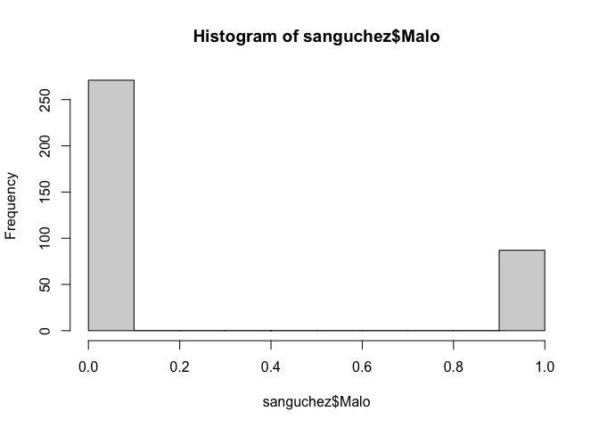<!-- -->

``` r
hist(sanguchez$Bueno)
```

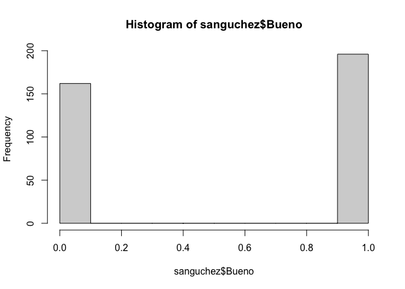<!-- -->

``` r
hist(sanguchez$Rico)
```

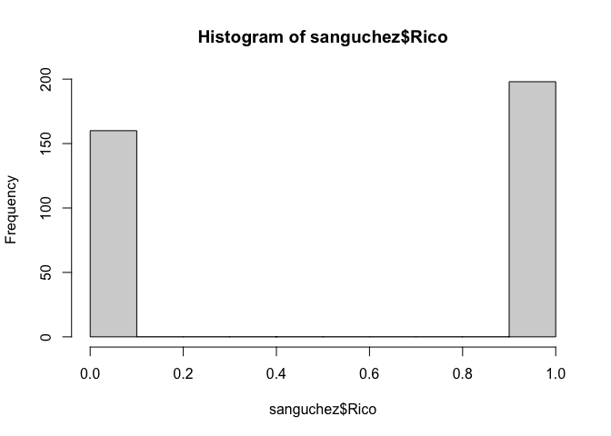<!-- -->

``` r
hist(sanguchez$Peor)
```

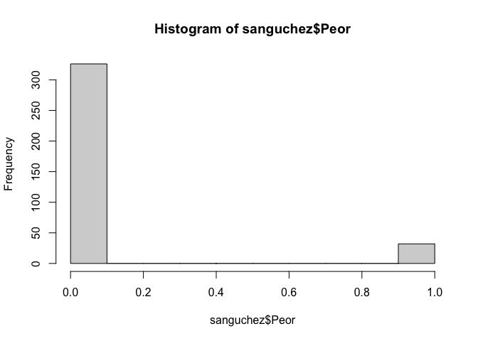<!-- -->

``` r
hist(sanguchez$suma1)
```

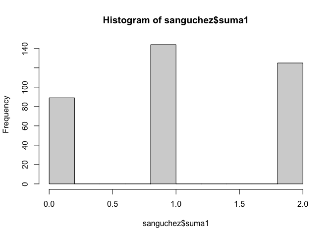<!-- -->

``` r
hist(sanguchez$suma2)
```

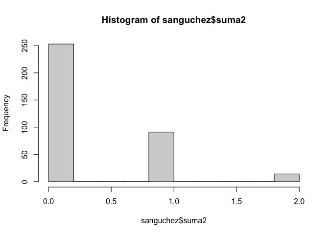<!-- -->

``` r
#install.packages("corrplot")
# cor(sanguchez[,c(6,7,8,9)])
# corr.test(sanguchez[,c(6,7,8,9)],use="complete")
```

``` r
attach(sanguchez)
```

    ## The following objects are masked from sanguchez (pos = 3):
    ## 
    ##     Direccion, Ingredientes, Local, nota, Precio, url

    ## The following objects are masked from sanguchez (pos = 4):
    ## 
    ##     Direccion, Ingredientes, Local, nota, Precio, url

``` r
# A continuación, extraeremos la cantidad de ingredientes de cada hamburguesa.
L_ingredientes = 
  strsplit(str_replace_all(sanguchez$Ingredientes,"(,.y|,y)",","),"( y |,)")

L = lapply(L_ingredientes,length)
L = as.numeric(L)

#Aquí pegamos la columna "cantidad_ingredientes" a la base de datos.
sanguchez$cantidad_ingredientes = L

#En primer lugar, obtenemos el máximo de cantidad de ingredientes.
max(sanguchez$cantidad_ingredientes)
```

    ## [1] 11

``` r
#Luego, revela los ingredientes de la hamburguesa que tiene la mayor cantidad.
 sanguchez[which.max(sanguchez$cantidad_ingredientes),"Ingredientes"]
```

    ## [1] "Salchicha, salsa de cilantro picante, papas hilo, napolitana (aceituna, choclo y tomate), pepinillo, y salsa Palermo (quesillo, huevo, piment\xf3n y mayonesa)."

``` r
#A continuación mostramos la ubicación de la hamburguesa, es decir, en que fila se encuentra.
which.max(sanguchez$cantidad_ingredientes)
```

    ## [1] 73

``` r
#Finalmente, enumera los ingredientes mostrando como fueron separados.
 L_ingredientes[which.max(sanguchez$cantidad_ingredientes)]
```

    ## [[1]]
    ##  [1] "Salchicha"                  " salsa de cilantro picante"
    ##  [3] " papas hilo"                " napolitana (aceituna"     
    ##  [5] " choclo"                    "tomate)"                   
    ##  [7] " pepinillo"                 " salsa Palermo (quesillo"  
    ##  [9] " huevo"                     " piment�n"                 
    ## [11] "mayonesa)."

``` r
#A partir de la limpieza de la base de datos realizada con anterioridad, damos paso a realizar diferentes representaciones gráficas de los datos.
attach(sanguchez)
```

    ## The following objects are masked from sanguchez (pos = 3):
    ## 
    ##     Bueno, Direccion, Ingredientes, Local, Malo, nota, Peor, Precio,
    ##     Rico, suma1, suma2, url

    ## The following objects are masked from sanguchez (pos = 4):
    ## 
    ##     Direccion, Ingredientes, Local, nota, Precio, url

    ## The following objects are masked from sanguchez (pos = 5):
    ## 
    ##     Direccion, Ingredientes, Local, nota, Precio, url

``` r
#A partir de la función summary obtenemos distintas métricas de cada variable
summary(sanguchez)
```

    ##      url               Local            Direccion             Precio     
    ##  Length:358         Length:358         Length:358         Min.   :  600  
    ##  Class :character   Class :character   Class :character   1st Qu.: 4892  
    ##  Mode  :character   Mode  :character   Mode  :character   Median : 5990  
    ##                                                           Mean   : 6061  
    ##                                                           3rd Qu.: 7100  
    ##                                                           Max.   :14500  
    ##  Ingredientes            nota           Bueno             Rico       
    ##  Length:358         Min.   :1.000   Min.   :0.0000   Min.   :0.0000  
    ##  Class :character   1st Qu.:3.000   1st Qu.:0.0000   1st Qu.:0.0000  
    ##  Mode  :character   Median :3.000   Median :1.0000   Median :1.0000  
    ##                     Mean   :3.154   Mean   :0.5475   Mean   :0.5531  
    ##                     3rd Qu.:4.000   3rd Qu.:1.0000   3rd Qu.:1.0000  
    ##                     Max.   :5.000   Max.   :1.0000   Max.   :1.0000  
    ##       Malo            Peor             suma1           suma2       
    ##  Min.   :0.000   Min.   :0.00000   Min.   :0.000   Min.   :0.0000  
    ##  1st Qu.:0.000   1st Qu.:0.00000   1st Qu.:1.000   1st Qu.:0.0000  
    ##  Median :0.000   Median :0.00000   Median :1.000   Median :0.0000  
    ##  Mean   :0.243   Mean   :0.08939   Mean   :1.101   Mean   :0.3324  
    ##  3rd Qu.:0.000   3rd Qu.:0.00000   3rd Qu.:2.000   3rd Qu.:1.0000  
    ##  Max.   :1.000   Max.   :1.00000   Max.   :2.000   Max.   :2.0000  
    ##  cantidad_ingredientes
    ##  Min.   : 1.00        
    ##  1st Qu.: 4.00        
    ##  Median : 5.00        
    ##  Mean   : 5.36        
    ##  3rd Qu.: 6.00        
    ##  Max.   :11.00

``` r
colnames(sanguchez)
```

    ##  [1] "url"                   "Local"                 "Direccion"            
    ##  [4] "Precio"                "Ingredientes"          "nota"                 
    ##  [7] "Bueno"                 "Rico"                  "Malo"                 
    ## [10] "Peor"                  "suma1"                 "suma2"                
    ## [13] "cantidad_ingredientes"

``` r
plot(nota,cantidad_ingredientes)
```

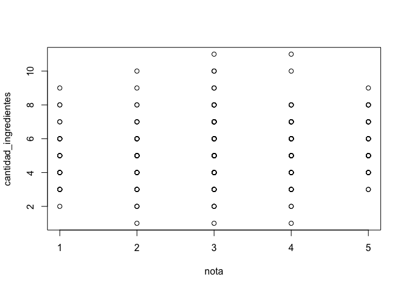<!-- -->

``` r
boxplot(cantidad_ingredientes)
```

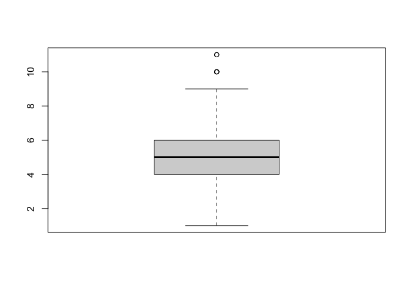<!-- -->

``` r
plot(nota,cantidad_ingredientes)
```

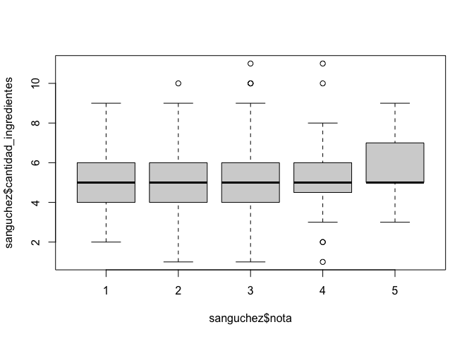<!-- -->

``` r
#ggplot ( Precio , aes ( x = x , color = data)) + 
#    geom_boxplot () + 
#    theme_void () + 
#    theme ( legend.position  =  " none " ) + 
#    facet_wrap ( ~ data, ncol = 3 )
```

``` r
# Correlación de pearson: 
cor(x = cbind(Precio,nota,cantidad_ingredientes,suma1, suma2), method = "pearson")
```

    ##                           Precio        nota cantidad_ingredientes      suma1
    ## Precio                1.00000000  0.05605002            0.21789118 0.08103913
    ## nota                  0.05605002  1.00000000            0.11813673 0.08442988
    ## cantidad_ingredientes 0.21789118  0.11813673            1.00000000 0.01089397
    ## suma1                 0.08103913  0.08442988            0.01089397 1.00000000
    ## suma2                 0.03673252 -0.40950868            0.04281004 0.15320285
    ##                             suma2
    ## Precio                 0.03673252
    ## nota                  -0.40950868
    ## cantidad_ingredientes  0.04281004
    ## suma1                  0.15320285
    ## suma2                  1.00000000

``` r
cor.plot(cbind(Precio,nota,cantidad_ingredientes, suma1, suma2))
```

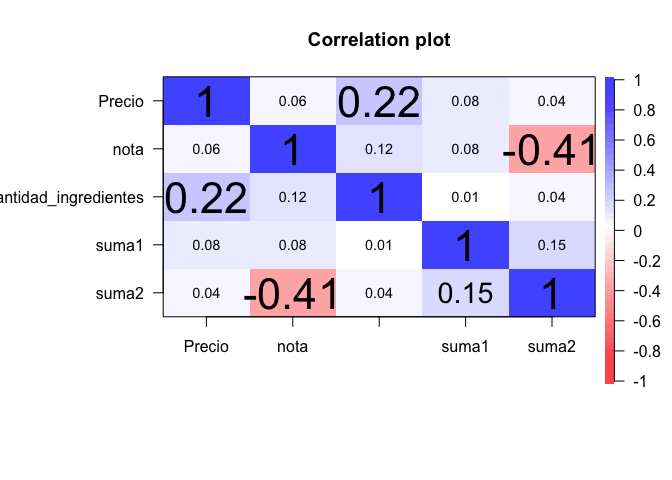<!-- -->

``` r
pairs(cbind(Precio,nota,cantidad_ingredientes, suma1, suma2))
```

<!-- -->

``` r
#install.packages("quanteda")
library("quanteda")
```

    ## Package version: 2.1.2

    ## Parallel computing: 2 of 4 threads used.

    ## See https://quanteda.io for tutorials and examples.

    ## 
    ## Attaching package: 'quanteda'

    ## The following object is masked from 'package:utils':
    ## 
    ##     View

``` r
# contamos palabra por palabra para los ingredientes:
ingre <- sanguchez$Ingredientes
ingre <- char_tolower(ingre)
ingre <- iconv(ingre, to = "ASCII//TRANSLIT")
b <- dfm(ingre, remove = c(stopwords("es")))
```

    ## Warning: NA is replaced by empty string

``` r
df_b = convert(b, to= "data.frame")
# reiniciamos los indices de los sanguchez
row.names(sanguchez) = NULL

# sacamos los signos que no nos aportan
df_b = df_b[,!names(df_b) %in% c("doc_id",",","!","?")]
```

``` r
# creamos el DF definitivo con todo lo anterior y ademas lo limpiamos de
# columnas que no nos interesan donde salen como parte de los ingredientes:
DF = cbind(sanguchez,df_b)
columnas_sacar = c("170","250","by","225","vacia3","20","185","a3n","/","%","220","300",
                   "\"" ,"(","230","1", ")","3","120","180",".","2","mah","175","340","5","100",
                   "200","ra","suma")
DF = DF[,!names(DF) %in% columnas_sacar]

# str(DF)
# obtenemos la suma que tendra el total de cada ingrediente:
DF_ingre = DF[,c(14:356)]
# Así se debe ocupar el order de manera correcta:
S = colSums(DF_ingre)
# con S reordenamos las columnas de DF_ingre:
DF_ingre = DF_ingre[,order(S,decreasing = T)]
S = S[order(S,decreasing = T)]
# ya con DF_ingre ordenado por cada ingrediente, podemos ahora ordenar
# DF para que los ingredientes a partir de la columna 11, puedan estar
# ordenados de mayor a menor por la cantidad de veces que sale cada uno en total
# de todas las hamburguesas:
# por ejemplo los 5 mas aparecidos con las veces de cada uno:
S[c(1:10)]
```

    ##      tomate       queso       palta    mayonesa     cebolla       salsa 
    ##          73          69          53          52          49          41 
    ##     lechuga hamburguesa      tocino         pan 
    ##          36          29          28          26

``` r
# ahora si reemplazamos DF[,c(14:356)] por DF_ingre y además ajustamos los

DF[,c(14:356)] = DF_ingre
col_iniciales = names(DF[1:13])
col_total = c(col_iniciales,c(names(DF_ingre)))
names(DF) = col_total

DF[,c(14:356)] = DF[,c(names(DF_ingre))]
names(DF[14]) = c(names(DF_ingre))[1]
col_iniciales = names(DF[1:13])
col_total = c(col_iniciales,c(names(DF_ingre)))
```

``` r
#install.packages("tidyverse")
library("tidyverse")
glimpse(DF)
```

    ## Rows: 358
    ## Columns: 356
    ## $ url                   <chr> "https://365sanguchez.com/abocado-cantina-buenos…
    ## $ Local                 <chr> "Abocado Cantina", "Alba Hotel", "Albedrio Resta…
    ## $ Direccion             <chr> "C1125AAE, French 2316, C1125AAF CABA, Argentina…
    ## $ Precio                <int> 5210, 7000, 7290, 8690, 4900, 6500, 5500, 8000, …
    ## $ Ingredientes          <chr> "Suprema de pollo dulce, espinaca, crema \xe1cid…
    ## $ nota                  <int> 3, 3, 4, 4, 4, 3, 3, 3, 3, 3, 4, 3, 3, 4, 2, 4, …
    ## $ Bueno                 <dbl> 1, 0, 0, 0, 1, 1, 1, 0, 0, 0, 1, 0, 0, 0, 0, 1, …
    ## $ Rico                  <dbl> 0, 0, 0, 1, 1, 0, 1, 1, 0, 1, 1, 0, 1, 1, 0, 1, …
    ## $ Malo                  <dbl> 0, 0, 0, 0, 0, 0, 0, 0, 0, 0, 0, 0, 0, 0, 0, 0, …
    ## $ Peor                  <dbl> 0, 0, 0, 0, 0, 0, 1, 0, 0, 0, 0, 1, 0, 0, 0, 0, …
    ## $ suma1                 <dbl> 1, 0, 0, 1, 2, 1, 2, 1, 0, 1, 2, 0, 1, 1, 0, 2, …
    ## $ suma2                 <dbl> 0, 0, 0, 0, 0, 0, 1, 0, 0, 0, 0, 1, 0, 0, 0, 0, …
    ## $ cantidad_ingredientes <dbl> 5, 4, 6, 5, 6, 6, 8, 3, 4, 5, 6, 5, 7, 6, 5, 5, …
    ## $ tomate                <dbl> 0, 0, 0, 0, 0, 0, 0, 0, 0, 0, 0, 0, 0, 0, 1, 0, …
    ## $ queso                 <dbl> 0, 0, 0, 0, 0, 0, 0, 0, 0, 1, 0, 0, 0, 0, 0, 1, …
    ## $ palta                 <dbl> 0, 0, 0, 0, 0, 0, 0, 0, 0, 0, 0, 0, 0, 0, 0, 0, …
    ## $ mayonesa              <dbl> 0, 0, 0, 0, 0, 0, 0, 0, 0, 0, 0, 0, 0, 0, 1, 0, …
    ## $ cebolla               <dbl> 0, 0, 0, 0, 0, 0, 0, 0, 0, 0, 0, 1, 0, 0, 0, 0, …
    ## $ salsa                 <dbl> 0, 0, 0, 0, 0, 0, 0, 0, 0, 1, 0, 1, 0, 0, 0, 0, …
    ## $ lechuga               <dbl> 0, 0, 0, 0, 0, 0, 0, 0, 0, 0, 0, 0, 0, 0, 0, 0, …
    ## $ hamburguesa           <dbl> 0, 0, 0, 0, 0, 0, 0, 0, 0, 0, 0, 0, 0, 0, 0, 0, …
    ## $ tocino                <dbl> 0, 0, 0, 0, 0, 0, 0, 0, 0, 0, 0, 1, 0, 0, 0, 1, …
    ## $ pan                   <dbl> 0, 0, 0, 0, 0, 0, 0, 0, 0, 0, 0, 0, 0, 0, 0, 0, …
    ## $ pepinillos            <dbl> 0, 0, 0, 0, 0, 0, 0, 0, 0, 1, 0, 0, 0, 0, 0, 0, …
    ## $ carne                 <dbl> 0, 0, 0, 0, 0, 0, 0, 0, 0, 0, 0, 0, 0, 0, 0, 0, …
    ## $ cerdo                 <dbl> 0, 0, 0, 0, 0, 0, 0, 0, 0, 1, 0, 0, 0, 0, 0, 0, …
    ## $ caramelizada          <dbl> 0, 0, 0, 0, 0, 0, 0, 0, 0, 0, 0, 1, 0, 0, 0, 0, …
    ## $ casera                <dbl> 0, 0, 0, 0, 0, 0, 0, 0, 0, 0, 0, 0, 0, 0, 2, 0, …
    ## $ cheddar               <dbl> 0, 0, 0, 0, 0, 0, 0, 0, 0, 1, 0, 0, 0, 0, 1, 0, …
    ## $ huevo                 <dbl> 0, 0, 0, 0, 0, 0, 0, 0, 0, 0, 0, 0, 0, 0, 0, 1, …
    ## $ mechada               <dbl> 0, 0, 0, 0, 0, 0, 0, 0, 0, 0, 0, 0, 0, 0, 0, 0, …
    ## $ pollo                 <dbl> 0, 0, 0, 0, 0, 0, 0, 0, 0, 0, 0, 0, 0, 0, 0, 0, …
    ## $ frito                 <dbl> 0, 0, 0, 0, 0, 0, 0, 0, 0, 0, 0, 0, 0, 0, 0, 0, …
    ## $ morada                <dbl> 0, 0, 0, 0, 0, 0, 0, 0, 0, 0, 0, 0, 0, 0, 0, 0, …
    ## $ azul                  <dbl> 0, 0, 0, 0, 0, 0, 0, 0, 0, 0, 0, 0, 0, 0, 0, 1, …
    ## $ lomo                  <dbl> 0, 0, 0, 0, 0, 0, 0, 0, 0, 0, 0, 0, 0, 0, 0, 0, …
    ## $ bbq                   <dbl> 0, 0, 0, 0, 0, 0, 0, 0, 0, 1, 0, 1, 0, 0, 0, 0, …
    ## $ marraqueta            <dbl> 0, 0, 0, 0, 0, 0, 0, 0, 0, 0, 0, 0, 0, 0, 0, 0, …
    ## $ chucrut               <dbl> 0, 0, 0, 0, 0, 0, 0, 0, 0, 0, 0, 0, 0, 0, 0, 0, …
    ## $ churrasco             <dbl> 0, 0, 0, 0, 0, 0, 0, 0, 0, 0, 0, 0, 0, 0, 0, 0, …
    ## $ mantecoso             <dbl> 0, 0, 0, 0, 0, 0, 0, 0, 0, 0, 0, 0, 0, 0, 1, 0, …
    ## $ papas                 <dbl> 0, 0, 0, 0, 0, 0, 0, 0, 0, 0, 0, 0, 0, 0, 0, 0, …
    ## $ crocante              <dbl> 0, 0, 0, 0, 0, 0, 0, 0, 0, 0, 0, 1, 0, 0, 0, 0, …
    ## $ mozzarella            <dbl> 0, 0, 0, 0, 0, 0, 0, 0, 0, 0, 0, 0, 0, 0, 0, 2, …
    ## $ hilo                  <dbl> 0, 0, 0, 0, 0, 0, 0, 0, 0, 0, 0, 0, 0, 0, 0, 0, …
    ## $ aros                  <dbl> 0, 0, 0, 0, 0, 0, 0, 0, 0, 0, 0, 0, 0, 0, 0, 0, …
    ## $ grs                   <dbl> 0, 0, 0, 0, 0, 0, 0, 0, 0, 0, 0, 0, 0, 0, 0, 0, …
    ## $ verde                 <dbl> 0, 0, 0, 0, 0, 0, 0, 0, 0, 0, 0, 0, 0, 0, 0, 0, …
    ## $ derretido             <dbl> 0, 0, 0, 0, 0, 0, 0, 0, 0, 0, 0, 0, 0, 0, 0, 0, …
    ## $ frica                 <dbl> 0, 0, 0, 0, 0, 0, 0, 0, 0, 0, 0, 0, 0, 0, 0, 0, …
    ## $ salchicha             <dbl> 0, 0, 0, 0, 0, 0, 0, 0, 0, 0, 0, 0, 0, 0, 0, 0, …
    ## $ mostaza               <dbl> 0, 0, 0, 0, 0, 0, 0, 0, 0, 0, 0, 0, 0, 0, 0, 0, …
    ## $ artesanal             <dbl> 0, 0, 0, 0, 0, 0, 0, 0, 0, 0, 0, 0, 0, 0, 0, 0, …
    ## $ vacuno                <dbl> 0, 0, 0, 0, 0, 0, 0, 0, 0, 0, 0, 0, 0, 0, 0, 0, …
    ## $ ciabatta              <dbl> 0, 0, 0, 0, 0, 0, 0, 0, 0, 0, 0, 0, 0, 0, 0, 0, …
    ## $ mix                   <dbl> 0, 0, 0, 0, 0, 0, 0, 0, 0, 0, 0, 0, 0, 0, 0, 0, …
    ## $ tomates               <dbl> 0, 0, 0, 0, 0, 0, 0, 0, 0, 0, 0, 0, 0, 0, 0, 0, …
    ## $ casa                  <dbl> 0, 0, 0, 0, 0, 0, 0, 0, 0, 0, 0, 0, 0, 0, 0, 0, …
    ## $ frita                 <dbl> 0, 0, 0, 0, 0, 0, 0, 0, 0, 0, 0, 0, 0, 0, 0, 0, …
    ## $ pepinillo             <dbl> 0, 0, 0, 0, 0, 0, 0, 0, 0, 0, 0, 0, 0, 0, 0, 0, …
    ## $ chilena               <dbl> 0, 0, 0, 0, 0, 0, 0, 0, 0, 0, 0, 0, 0, 0, 0, 0, …
    ## $ pebre                 <dbl> 0, 0, 0, 0, 0, 0, 0, 0, 0, 0, 0, 0, 0, 0, 0, 0, …
    ## $ verdes                <dbl> 0, 0, 0, 0, 0, 0, 0, 0, 0, 0, 0, 0, 0, 0, 0, 0, …
    ## $ lomito                <dbl> 0, 0, 0, 0, 0, 0, 0, 0, 0, 0, 0, 0, 0, 0, 0, 0, …
    ## $ albahaca              <dbl> 0, 0, 0, 0, 0, 0, 0, 0, 0, 0, 0, 0, 0, 0, 0, 0, …
    ## $ coleslaw              <dbl> 0, 0, 0, 0, 0, 0, 0, 0, 0, 1, 0, 0, 0, 0, 0, 0, …
    ## $ alioli                <dbl> 0, 0, 0, 0, 0, 0, 0, 0, 0, 0, 0, 0, 0, 0, 0, 0, …
    ## $ asados                <dbl> 0, 0, 0, 0, 0, 0, 0, 0, 0, 0, 0, 0, 0, 0, 0, 0, …
    ## $ americana             <dbl> 0, 0, 0, 0, 0, 0, 0, 0, 0, 0, 0, 0, 0, 0, 0, 0, …
    ## $ manzana               <dbl> 0, 0, 0, 0, 0, 0, 0, 0, 0, 0, 0, 0, 0, 0, 0, 0, …
    ## $ plancha               <dbl> 0, 0, 0, 0, 0, 0, 0, 0, 0, 0, 0, 0, 0, 0, 0, 0, …
    ## $ filete                <dbl> 0, 0, 0, 0, 0, 0, 0, 0, 0, 0, 0, 0, 0, 0, 0, 0, …
    ## $ wagyu                 <dbl> 0, 0, 0, 0, 0, 0, 0, 0, 0, 0, 0, 0, 0, 0, 0, 0, …
    ## $ berros                <dbl> 0, 0, 0, 0, 0, 0, 0, 0, 0, 0, 0, 0, 0, 0, 0, 0, …
    ## $ ciboulette            <dbl> 0, 0, 0, 0, 0, 0, 0, 0, 0, 0, 0, 0, 0, 0, 0, 0, …
    ## $ ahumada               <dbl> 0, 0, 0, 0, 0, 0, 0, 0, 0, 0, 0, 0, 0, 0, 0, 0, …
    ## $ doble                 <dbl> 0, 0, 0, 0, 0, 0, 0, 0, 0, 0, 0, 0, 0, 0, 0, 0, …
    ## $ asado                 <dbl> 0, 0, 0, 0, 0, 0, 0, 0, 0, 0, 0, 0, 0, 0, 0, 0, …
    ## $ ensalada              <dbl> 0, 0, 0, 0, 0, 0, 0, 0, 0, 0, 0, 0, 0, 0, 0, 0, …
    ## $ quesos                <dbl> 0, 0, 0, 0, 0, 0, 0, 0, 0, 0, 0, 0, 0, 0, 1, 0, …
    ## $ caramelizadas         <dbl> 0, 0, 0, 0, 0, 0, 0, 0, 0, 0, 0, 0, 0, 0, 0, 1, …
    ## $ cordero               <dbl> 0, 0, 0, 0, 0, 0, 0, 0, 0, 0, 0, 0, 0, 0, 0, 0, …
    ## $ pastelera             <dbl> 0, 0, 0, 0, 0, 0, 0, 0, 0, 0, 0, 0, 0, 0, 0, 0, …
    ## $ choclo                <dbl> 0, 0, 0, 0, 0, 0, 0, 0, 0, 0, 0, 0, 0, 0, 0, 0, …
    ## $ cilantro              <dbl> 0, 0, 0, 0, 0, 0, 0, 0, 0, 0, 0, 0, 0, 0, 0, 0, …
    ## $ apanados              <dbl> 0, 0, 0, 0, 0, 0, 0, 0, 0, 0, 0, 0, 0, 0, 0, 0, …
    ## $ fundido               <dbl> 0, 0, 0, 0, 0, 0, 0, 0, 0, 0, 0, 0, 0, 0, 0, 0, …
    ## $ vegetariana           <dbl> 0, 0, 0, 0, 0, 0, 0, 0, 0, 0, 0, 0, 0, 0, 0, 0, …
    ## $ casero                <dbl> 0, 0, 0, 0, 0, 0, 0, 0, 0, 0, 0, 0, 0, 0, 0, 0, …
    ## $ chutney               <dbl> 0, 0, 0, 0, 0, 0, 0, 0, 0, 0, 0, 0, 0, 0, 0, 0, …
    ## $ porotos               <dbl> 0, 0, 0, 0, 0, 0, 0, 0, 0, 0, 0, 0, 0, 0, 0, 0, …
    ## $ roquefort             <dbl> 0, 0, 0, 0, 0, 0, 0, 0, 0, 0, 0, 0, 0, 0, 0, 0, …
    ## $ saltado               <dbl> 0, 0, 0, 0, 0, 0, 0, 0, 0, 0, 0, 0, 0, 0, 0, 0, …
    ## $ crema                 <dbl> 0, 0, 0, 0, 0, 0, 0, 0, 0, 0, 0, 0, 0, 0, 0, 0, …
    ## $ dijon                 <dbl> 0, 0, 0, 0, 0, 0, 0, 0, 0, 0, 0, 0, 0, 0, 0, 0, …
    ## $ chimichurri           <dbl> 0, 0, 0, 0, 0, 0, 0, 0, 0, 0, 0, 0, 0, 0, 0, 0, …
    ## $ agregado              <dbl> 0, 0, 0, 0, 0, 0, 0, 0, 0, 0, 0, 0, 0, 0, 0, 0, …
    ## $ angus                 <dbl> 0, 0, 0, 0, 0, 0, 0, 0, 0, 0, 0, 0, 0, 0, 0, 0, …
    ## $ mayo                  <dbl> 0, 0, 0, 0, 0, 0, 0, 0, 0, 0, 0, 0, 0, 0, 0, 0, …
    ## $ sriracha              <dbl> 0, 0, 0, 0, 0, 0, 0, 0, 0, 0, 0, 0, 0, 0, 0, 0, …
    ## $ costillar             <dbl> 0, 0, 0, 0, 0, 0, 0, 0, 0, 1, 0, 0, 0, 0, 0, 0, …
    ## $ desmenuzada           <dbl> 0, 0, 0, 0, 0, 0, 0, 0, 0, 0, 0, 1, 0, 0, 0, 0, …
    ## $ cerveza               <dbl> 0, 0, 0, 0, 0, 0, 0, 0, 0, 0, 0, 1, 0, 0, 0, 0, …
    ## $ burger                <dbl> 0, 0, 0, 0, 0, 0, 0, 0, 0, 0, 0, 0, 0, 0, 1, 0, …
    ## $ gramos                <dbl> 0, 0, 0, 0, 0, 0, 0, 0, 0, 0, 0, 0, 0, 0, 1, 0, …
    ## $ pescado               <dbl> 0, 0, 0, 0, 0, 0, 0, 0, 0, 0, 0, 0, 0, 0, 0, 0, …
    ## $ posta                 <dbl> 0, 0, 0, 0, 0, 0, 0, 0, 0, 0, 0, 0, 0, 0, 0, 0, …
    ## $ rosada                <dbl> 0, 0, 0, 0, 0, 0, 0, 0, 0, 0, 0, 0, 0, 0, 0, 0, …
    ## $ cognac                <dbl> 0, 0, 0, 0, 0, 0, 0, 0, 0, 0, 0, 0, 0, 0, 0, 0, …
    ## $ italiano              <dbl> 0, 0, 0, 0, 0, 0, 0, 0, 0, 0, 0, 0, 0, 0, 0, 0, …
    ## $ ajo                   <dbl> 0, 0, 0, 0, 0, 0, 0, 0, 0, 0, 0, 0, 0, 0, 0, 0, …
    ## $ brioche               <dbl> 0, 0, 0, 0, 0, 0, 0, 0, 0, 0, 0, 0, 0, 0, 0, 0, …
    ## $ ahumado               <dbl> 0, 0, 0, 0, 0, 0, 0, 0, 0, 0, 0, 0, 0, 0, 0, 0, …
    ## $ lactonesa             <dbl> 0, 0, 0, 0, 0, 0, 0, 0, 0, 0, 0, 0, 0, 0, 0, 0, …
    ## $ panceta               <dbl> 0, 0, 0, 0, 0, 0, 0, 0, 0, 0, 0, 0, 0, 0, 0, 0, …
    ## $ nueces                <dbl> 0, 0, 0, 0, 0, 0, 0, 0, 0, 0, 0, 0, 0, 0, 0, 0, …
    ## $ guacamole             <dbl> 0, 0, 0, 0, 0, 0, 0, 0, 0, 0, 0, 0, 0, 0, 0, 0, …
    ## $ prieta                <dbl> 0, 0, 0, 0, 0, 0, 0, 0, 0, 0, 0, 0, 0, 0, 0, 0, …
    ## $ cabra                 <dbl> 0, 0, 0, 0, 0, 0, 0, 0, 0, 0, 0, 0, 0, 0, 0, 0, …
    ## $ pimentones            <dbl> 0, 0, 0, 0, 0, 0, 0, 0, 0, 0, 0, 0, 0, 0, 0, 0, …
    ## $ tostadas              <dbl> 0, 0, 0, 0, 0, 0, 0, 0, 0, 0, 0, 0, 0, 0, 0, 0, …
    ## $ lengua                <dbl> 0, 0, 0, 0, 0, 0, 0, 0, 0, 0, 0, 0, 0, 0, 0, 0, …
    ## $ berenjena             <dbl> 0, 0, 0, 0, 0, 0, 0, 0, 0, 0, 0, 0, 0, 0, 0, 0, …
    ## $ hojas                 <dbl> 0, 0, 0, 0, 0, 0, 0, 0, 0, 0, 0, 0, 0, 0, 0, 0, …
    ## $ soya                  <dbl> 0, 0, 0, 0, 0, 0, 0, 0, 0, 0, 0, 0, 0, 0, 0, 0, …
    ## $ pechuga               <dbl> 0, 0, 0, 0, 0, 0, 0, 0, 0, 0, 0, 0, 0, 0, 0, 0, …
    ## $ pernil                <dbl> 0, 0, 0, 0, 0, 0, 0, 0, 0, 0, 0, 0, 0, 0, 0, 0, …
    ## $ molida                <dbl> 0, 0, 0, 0, 0, 0, 0, 0, 0, 0, 0, 0, 0, 0, 0, 0, …
    ## $ chino                 <dbl> 0, 0, 0, 0, 0, 0, 0, 0, 0, 0, 0, 0, 0, 0, 0, 0, …
    ## $ vapor                 <dbl> 0, 0, 0, 0, 0, 0, 0, 0, 0, 0, 0, 0, 0, 0, 0, 0, …
    ## $ trozos                <dbl> 0, 0, 0, 0, 0, 0, 0, 0, 0, 0, 0, 0, 0, 0, 0, 0, …
    ## $ crispy                <dbl> 0, 0, 0, 0, 0, 0, 0, 0, 0, 0, 0, 0, 0, 0, 0, 0, …
    ## $ perejil               <dbl> 0, 0, 0, 0, 0, 0, 0, 0, 0, 0, 0, 0, 0, 0, 0, 0, …
    ## $ punta                 <dbl> 0, 0, 0, 0, 0, 0, 0, 0, 0, 0, 0, 0, 0, 0, 0, 0, …
    ## $ camembert             <dbl> 0, 0, 0, 0, 0, 0, 0, 0, 0, 0, 0, 0, 0, 0, 0, 0, …
    ## $ apanado               <dbl> 0, 0, 0, 0, 0, 0, 0, 0, 0, 0, 0, 0, 0, 0, 0, 0, …
    ## $ panko                 <dbl> 0, 0, 0, 0, 0, 0, 0, 0, 0, 0, 0, 0, 0, 0, 0, 0, …
    ## $ chorizo               <dbl> 0, 0, 0, 0, 0, 0, 0, 0, 0, 0, 0, 0, 0, 0, 0, 0, …
    ## $ braseado              <dbl> 0, 0, 0, 0, 0, 0, 0, 0, 0, 0, 0, 0, 0, 0, 0, 0, …
    ## $ repollo               <dbl> 0, 0, 0, 0, 0, 0, 0, 0, 0, 0, 0, 0, 0, 0, 0, 0, …
    ## $ agridulce             <dbl> 0, 0, 0, 0, 0, 0, 0, 0, 0, 0, 0, 0, 0, 0, 0, 0, …
    ## $ naranja               <dbl> 0, 0, 0, 0, 0, 0, 0, 0, 0, 0, 0, 0, 0, 0, 0, 0, …
    ## $ romero                <dbl> 0, 0, 0, 0, 0, 0, 0, 0, 0, 0, 0, 0, 0, 0, 0, 0, …
    ## $ merluza               <dbl> 0, 0, 0, 0, 0, 0, 0, 0, 0, 0, 0, 0, 0, 0, 0, 0, …
    ## $ anticuchera           <dbl> 0, 0, 0, 0, 0, 0, 0, 0, 0, 0, 0, 0, 0, 0, 0, 0, …
    ## $ deshuesado            <dbl> 0, 0, 0, 0, 0, 0, 0, 0, 0, 0, 0, 0, 0, 0, 0, 0, …
    ## $ marinado              <dbl> 0, 0, 0, 0, 0, 0, 0, 0, 0, 0, 0, 0, 0, 0, 0, 0, …
    ## $ brie                  <dbl> 0, 0, 0, 0, 0, 0, 0, 0, 0, 0, 0, 0, 0, 0, 0, 0, …
    ## $ mermelada             <dbl> 0, 0, 0, 0, 0, 0, 0, 0, 0, 0, 0, 0, 0, 0, 0, 0, …
    ## $ amasado               <dbl> 0, 0, 0, 0, 0, 0, 0, 0, 0, 0, 0, 0, 0, 0, 0, 0, …
    ## $ res                   <dbl> 0, 0, 0, 0, 0, 0, 0, 0, 0, 0, 0, 0, 0, 0, 0, 0, …
    ## $ arrollado             <dbl> 0, 0, 0, 0, 0, 0, 0, 0, 0, 0, 0, 0, 0, 0, 0, 0, …
    ## $ huaso                 <dbl> 0, 0, 0, 0, 0, 0, 0, 0, 0, 0, 0, 0, 0, 0, 0, 0, …
    ## $ pepino                <dbl> 0, 0, 0, 0, 0, 0, 0, 0, 0, 0, 0, 0, 0, 0, 0, 0, …
    ## $ caseros               <dbl> 0, 0, 0, 0, 0, 0, 0, 0, 0, 1, 0, 0, 0, 0, 0, 0, …
    ## $ bondiola              <dbl> 0, 0, 0, 0, 0, 0, 0, 0, 0, 0, 0, 1, 0, 0, 0, 0, …
    ## $ braseada              <dbl> 0, 0, 0, 0, 0, 0, 0, 0, 0, 0, 0, 1, 0, 0, 0, 0, …
    ## $ codorniz              <dbl> 0, 0, 0, 0, 0, 0, 0, 0, 0, 0, 0, 0, 0, 0, 0, 1, …
    ## $ portobello            <dbl> 0, 0, 0, 0, 0, 0, 0, 0, 0, 0, 0, 0, 0, 0, 0, 1, …
    ## $ manzanas              <dbl> 0, 0, 0, 0, 0, 0, 0, 0, 0, 0, 0, 0, 0, 0, 0, 1, …
    ## $ costillas             <dbl> 0, 0, 0, 0, 0, 0, 0, 0, 0, 0, 0, 0, 0, 0, 0, 0, …
    ## $ barbecue              <dbl> 0, 0, 0, 0, 0, 0, 0, 0, 0, 0, 0, 0, 0, 0, 0, 0, …
    ## $ cebollas              <dbl> 0, 0, 0, 0, 0, 0, 0, 0, 0, 0, 0, 0, 0, 0, 0, 0, …
    ## $ lago                  <dbl> 0, 0, 0, 0, 0, 0, 0, 0, 0, 0, 0, 0, 0, 0, 0, 0, …
    ## $ ranco                 <dbl> 0, 0, 0, 0, 0, 0, 0, 0, 0, 0, 0, 0, 0, 0, 0, 0, …
    ## $ hummus                <dbl> 0, 0, 0, 0, 0, 0, 0, 0, 0, 0, 0, 0, 0, 0, 0, 0, …
    ## $ panini                <dbl> 0, 0, 0, 0, 0, 0, 0, 0, 0, 0, 0, 0, 0, 0, 0, 0, …
    ## $ viene                 <dbl> 0, 0, 0, 0, 0, 0, 0, 0, 0, 0, 0, 0, 0, 0, 0, 0, …
    ## $ caldo                 <dbl> 0, 0, 0, 0, 0, 0, 0, 0, 0, 0, 0, 0, 0, 0, 0, 0, …
    ## $ untar                 <dbl> 0, 0, 0, 0, 0, 0, 0, 0, 0, 0, 0, 0, 0, 0, 0, 0, …
    ## $ habas                 <dbl> 0, 0, 0, 0, 0, 0, 0, 0, 0, 0, 0, 0, 0, 0, 0, 0, …
    ## $ garbanzos             <dbl> 0, 0, 0, 0, 0, 0, 0, 0, 0, 0, 0, 0, 0, 0, 0, 0, …
    ## $ campo                 <dbl> 0, 0, 0, 0, 0, 0, 0, 0, 0, 0, 0, 0, 0, 0, 0, 0, …
    ## $ caldito               <dbl> 0, 0, 0, 0, 0, 0, 0, 0, 0, 0, 0, 0, 0, 0, 0, 0, …
    ## $ confit                <dbl> 0, 0, 0, 0, 0, 0, 0, 0, 0, 0, 0, 0, 0, 0, 0, 0, …
    ## $ grillada              <dbl> 0, 0, 0, 0, 0, 0, 0, 0, 0, 0, 0, 0, 0, 0, 0, 0, …
    ## $ lentejas              <dbl> 0, 0, 0, 0, 0, 0, 0, 0, 0, 0, 0, 0, 0, 0, 0, 0, …
    ## $ zanahoria             <dbl> 0, 0, 0, 0, 0, 0, 0, 0, 0, 0, 0, 0, 0, 0, 0, 0, …
    ## $ avena                 <dbl> 0, 0, 0, 0, 0, 0, 0, 0, 0, 0, 0, 0, 0, 0, 0, 0, …
    ## $ verduras              <dbl> 0, 0, 0, 0, 0, 0, 0, 0, 0, 0, 0, 0, 0, 0, 0, 0, …
    ## $ wok                   <dbl> 0, 0, 0, 0, 0, 0, 0, 0, 0, 0, 0, 0, 0, 0, 0, 0, …
    ## $ fresca                <dbl> 0, 0, 0, 0, 0, 0, 0, 0, 0, 0, 0, 0, 0, 0, 0, 0, …
    ## $ kassler               <dbl> 0, 0, 0, 0, 0, 0, 0, 0, 0, 0, 0, 0, 0, 0, 0, 0, …
    ## $ aceite                <dbl> 0, 0, 0, 0, 0, 0, 0, 0, 0, 0, 0, 0, 0, 0, 0, 0, …
    ## $ oliva                 <dbl> 0, 0, 0, 0, 0, 0, 0, 0, 0, 0, 0, 0, 0, 0, 0, 0, …
    ## $ secreta               <dbl> 0, 0, 0, 0, 0, 0, 0, 0, 0, 0, 0, 0, 0, 0, 0, 0, …
    ## $ haussmann             <dbl> 0, 0, 0, 0, 0, 0, 0, 0, 0, 0, 0, 0, 0, 0, 0, 0, …
    ## $ jengibre              <dbl> 0, 0, 0, 0, 0, 0, 0, 0, 0, 0, 0, 0, 0, 0, 0, 0, …
    ## $ negros                <dbl> 0, 0, 0, 0, 0, 0, 0, 0, 0, 0, 0, 0, 0, 0, 0, 0, …
    ## $ betarraga             <dbl> 0, 0, 0, 0, 0, 0, 0, 0, 0, 0, 0, 0, 0, 0, 0, 0, …
    ## $ arroz                 <dbl> 0, 0, 0, 0, 0, 0, 0, 0, 0, 0, 0, 0, 0, 0, 0, 0, …
    ## $ integral              <dbl> 0, 0, 0, 0, 0, 0, 0, 0, 0, 0, 0, 0, 0, 0, 0, 0, …
    ## $ secretos              <dbl> 0, 0, 0, 0, 0, 0, 0, 0, 0, 0, 0, 0, 0, 0, 0, 0, …
    ## $ vegetales             <dbl> 0, 0, 0, 0, 0, 0, 0, 0, 0, 0, 0, 0, 0, 0, 0, 0, …
    ## $ grillados             <dbl> 0, 0, 0, 0, 0, 0, 0, 0, 0, 0, 0, 0, 0, 0, 0, 0, …
    ## $ gratinado             <dbl> 0, 0, 0, 0, 0, 0, 0, 0, 0, 0, 0, 0, 0, 0, 0, 0, …
    ## $ misuna                <dbl> 0, 0, 0, 0, 0, 0, 0, 0, 0, 0, 0, 0, 0, 0, 0, 0, …
    ## $ blanco                <dbl> 0, 0, 0, 0, 0, 0, 0, 0, 0, 0, 0, 0, 0, 0, 0, 0, …
    ## $ trufado               <dbl> 0, 0, 0, 0, 0, 0, 0, 0, 0, 0, 0, 0, 0, 0, 0, 0, …
    ## $ sopaipillas           <dbl> 0, 0, 0, 0, 0, 0, 0, 0, 0, 0, 0, 0, 0, 0, 0, 0, …
    ## $ quilicura             <dbl> 0, 0, 0, 0, 0, 0, 0, 0, 0, 0, 0, 0, 0, 0, 0, 0, …
    ## $ querricura            <dbl> 0, 0, 0, 0, 0, 0, 0, 0, 0, 0, 0, 0, 0, 0, 0, 0, …
    ## $ santiago              <dbl> 0, 0, 0, 0, 0, 0, 0, 0, 0, 0, 0, 0, 0, 0, 0, 0, …
    ## $ barato                <dbl> 0, 0, 0, 0, 0, 0, 0, 0, 0, 0, 0, 0, 0, 0, 0, 0, …
    ## $ as                    <dbl> 0, 0, 0, 0, 0, 0, 0, 0, 0, 0, 0, 0, 0, 0, 0, 0, …
    ## $ completos             <dbl> 0, 0, 0, 0, 0, 0, 0, 0, 0, 0, 0, 0, 0, 0, 0, 0, …
    ## $ lomitos               <dbl> 0, 0, 0, 0, 0, 0, 0, 0, 0, 0, 0, 0, 0, 0, 0, 0, …
    ## $ frutillas             <dbl> 0, 0, 0, 0, 0, 0, 0, 0, 0, 0, 0, 0, 0, 0, 0, 0, …
    ## $ grilladas             <dbl> 0, 0, 0, 0, 0, 0, 0, 0, 0, 0, 0, 0, 0, 0, 0, 0, …
    ## $ lolo                  <dbl> 0, 0, 0, 0, 0, 0, 0, 0, 0, 0, 0, 0, 0, 0, 0, 0, …
    ## $ green                 <dbl> 0, 0, 0, 0, 0, 0, 0, 0, 0, 0, 0, 0, 0, 0, 0, 0, …
    ## $ masa                  <dbl> 0, 0, 0, 0, 0, 0, 0, 0, 0, 0, 0, 0, 0, 0, 0, 0, …
    ## $ madre                 <dbl> 0, 0, 0, 0, 0, 0, 0, 0, 0, 0, 0, 0, 0, 0, 0, 0, …
    ## $ salsita               <dbl> 0, 0, 0, 0, 0, 0, 0, 0, 0, 0, 0, 0, 0, 0, 0, 0, …
    ## $ creo                  <dbl> 0, 0, 0, 0, 0, 0, 0, 0, 0, 0, 0, 0, 0, 0, 0, 0, …
    ## $ zapallo               <dbl> 0, 0, 0, 0, 0, 0, 0, 0, 0, 0, 0, 0, 0, 0, 0, 0, …
    ## $ rojos                 <dbl> 0, 0, 0, 0, 0, 0, 0, 0, 0, 0, 0, 0, 0, 0, 0, 0, …
    ## $ baguette              <dbl> 0, 0, 0, 0, 0, 0, 0, 0, 0, 0, 0, 0, 0, 0, 0, 0, …
    ## $ yogur                 <dbl> 0, 0, 0, 0, 0, 0, 0, 0, 0, 0, 0, 0, 0, 0, 0, 0, …
    ## $ tempura               <dbl> 0, 0, 0, 0, 0, 0, 0, 0, 0, 0, 0, 0, 0, 0, 0, 0, …
    ## $ asada                 <dbl> 0, 0, 0, 0, 0, 0, 0, 0, 0, 0, 0, 0, 0, 0, 0, 0, …
    ## $ pastrami              <dbl> 0, 0, 0, 0, 0, 0, 0, 0, 0, 0, 0, 0, 0, 0, 0, 0, …
    ## $ caliente              <dbl> 0, 0, 0, 0, 0, 0, 0, 0, 0, 0, 0, 0, 0, 0, 0, 0, …
    ## $ `150`                 <dbl> 0, 0, 0, 0, 0, 0, 0, 0, 0, 0, 0, 0, 0, 0, 0, 0, …
    ## $ chile                 <dbl> 0, 0, 0, 0, 0, 0, 0, 0, 0, 0, 0, 0, 0, 0, 0, 0, …
    ## $ chilli                <dbl> 0, 0, 0, 0, 0, 0, 0, 0, 0, 0, 0, 0, 0, 0, 0, 0, …
    ## $ cherry                <dbl> 0, 0, 0, 0, 0, 0, 0, 0, 0, 0, 0, 0, 0, 0, 0, 0, …
    ## $ kiss                  <dbl> 0, 0, 0, 0, 0, 0, 0, 0, 0, 0, 0, 0, 0, 0, 0, 0, …
    ## $ my                    <dbl> 0, 0, 0, 0, 0, 0, 0, 0, 0, 0, 0, 0, 0, 0, 0, 0, …
    ## $ hass                  <dbl> 0, 0, 0, 0, 0, 0, 0, 0, 0, 0, 0, 0, 0, 0, 0, 0, …
    ## $ fresquito             <dbl> 0, 0, 0, 0, 0, 0, 0, 0, 0, 0, 0, 0, 0, 0, 0, 0, …
    ## $ buen                  <dbl> 0, 0, 0, 0, 0, 0, 0, 0, 0, 0, 0, 0, 0, 0, 0, 0, …
    ## $ color                 <dbl> 0, 0, 0, 0, 0, 0, 0, 0, 0, 0, 0, 0, 0, 0, 0, 0, …
    ## $ bien                  <dbl> 0, 0, 0, 0, 0, 0, 0, 0, 0, 0, 0, 0, 0, 0, 0, 0, …
    ## $ jugoso                <dbl> 0, 0, 0, 0, 0, 0, 0, 0, 0, 0, 0, 0, 0, 0, 0, 0, …
    ## $ buena                 <dbl> 0, 0, 0, 0, 0, 0, 0, 0, 0, 0, 0, 0, 0, 0, 0, 0, …
    ## $ complementada         <dbl> 0, 0, 0, 0, 0, 0, 0, 0, 0, 0, 0, 0, 0, 0, 0, 0, …
    ## $ poroto                <dbl> 0, 0, 0, 0, 0, 0, 0, 0, 0, 0, 0, 0, 0, 0, 0, 0, …
    ## $ panita                <dbl> 0, 0, 0, 0, 0, 0, 0, 0, 0, 0, 0, 0, 0, 0, 0, 0, …
    ## $ fritas                <dbl> 0, 0, 0, 0, 0, 0, 0, 0, 0, 0, 0, 0, 0, 0, 0, 0, …
    ## $ relleno               <dbl> 0, 0, 0, 0, 0, 0, 0, 0, 0, 0, 0, 0, 0, 0, 0, 0, …
    ## $ trocitos              <dbl> 0, 0, 0, 0, 0, 0, 0, 0, 0, 0, 0, 0, 0, 0, 0, 0, …
    ## $ china                 <dbl> 0, 0, 0, 0, 0, 0, 0, 0, 0, 0, 0, 0, 0, 0, 0, 0, …
    ## $ picante               <dbl> 0, 0, 0, 0, 0, 0, 0, 0, 0, 0, 0, 0, 0, 0, 0, 0, …
    ## $ espinaca              <dbl> 0, 0, 0, 0, 0, 0, 0, 0, 0, 0, 0, 0, 0, 0, 0, 0, …
    ## $ super                 <dbl> 0, 0, 0, 0, 0, 0, 0, 0, 0, 0, 0, 0, 0, 0, 0, 0, …
    ## $ frank                 <dbl> 0, 0, 0, 0, 0, 0, 0, 0, 0, 0, 0, 0, 0, 0, 0, 0, …
    ## $ alemana               <dbl> 0, 0, 0, 0, 0, 0, 0, 0, 0, 0, 0, 0, 0, 0, 0, 0, …
    ## $ ketchup               <dbl> 0, 0, 0, 0, 0, 0, 0, 0, 0, 0, 0, 0, 0, 0, 0, 0, …
    ## $ paleta                <dbl> 0, 0, 0, 0, 0, 0, 0, 0, 0, 0, 0, 0, 0, 0, 0, 0, …
    ## $ ganso                 <dbl> 0, 0, 0, 0, 0, 0, 0, 0, 0, 0, 0, 0, 0, 0, 0, 0, …
    ## $ encurtidos            <dbl> 0, 0, 0, 0, 0, 0, 0, 0, 0, 0, 0, 0, 0, 0, 0, 0, …
    ## $ desmenuzado           <dbl> 0, 0, 0, 0, 0, 0, 0, 0, 0, 0, 0, 0, 0, 0, 0, 0, …
    ## $ deshidratados         <dbl> 0, 0, 0, 0, 0, 0, 0, 0, 0, 0, 0, 0, 0, 0, 0, 0, …
    ## $ cacerola              <dbl> 0, 0, 0, 0, 0, 0, 0, 0, 0, 0, 0, 0, 0, 0, 0, 0, …
    ## $ papayas               <dbl> 0, 0, 0, 0, 0, 0, 0, 0, 0, 0, 0, 0, 0, 0, 0, 0, …
    ## $ tiras                 <dbl> 0, 0, 0, 0, 0, 0, 0, 0, 0, 0, 0, 0, 0, 0, 0, 0, …
    ## $ onion                 <dbl> 0, 0, 0, 0, 0, 0, 0, 0, 0, 0, 0, 0, 0, 0, 0, 0, …
    ## $ rings                 <dbl> 0, 0, 0, 0, 0, 0, 0, 0, 0, 0, 0, 0, 0, 0, 0, 0, …
    ## $ mezclada              <dbl> 0, 0, 0, 0, 0, 0, 0, 0, 0, 0, 0, 0, 0, 0, 0, 0, …
    ## $ pimientos             <dbl> 0, 0, 0, 0, 0, 0, 0, 0, 0, 0, 0, 0, 0, 0, 0, 0, …
    ## $ pasta                 <dbl> 0, 0, 0, 0, 0, 0, 0, 0, 0, 0, 0, 0, 0, 0, 0, 0, …
    ## $ hallula               <dbl> 0, 0, 0, 0, 0, 0, 0, 0, 0, 0, 0, 0, 0, 0, 0, 0, …
    ## $ pechito               <dbl> 0, 0, 0, 0, 0, 0, 0, 0, 0, 0, 0, 0, 0, 0, 0, 0, …
    ## $ golden                <dbl> 0, 0, 0, 0, 0, 0, 0, 0, 0, 0, 0, 0, 0, 0, 0, 0, …
    ## $ semillas              <dbl> 0, 0, 0, 0, 0, 0, 0, 0, 0, 0, 0, 0, 0, 0, 0, 0, …
    ## $ camarones             <dbl> 0, 0, 0, 0, 0, 0, 0, 0, 0, 0, 0, 0, 0, 0, 0, 0, …
    ## $ fritos                <dbl> 0, 0, 0, 0, 0, 0, 0, 0, 0, 0, 0, 0, 0, 0, 0, 0, …
    ## $ sweet                 <dbl> 0, 0, 0, 0, 0, 0, 0, 0, 0, 0, 0, 0, 0, 0, 0, 0, …
    ## $ chili                 <dbl> 0, 0, 0, 0, 0, 0, 0, 0, 0, 0, 0, 0, 0, 0, 0, 0, …
    ## $ choripan              <dbl> 0, 0, 0, 0, 0, 0, 0, 0, 0, 0, 0, 0, 0, 0, 0, 0, …
    ## $ cochayuyo             <dbl> 0, 0, 0, 0, 0, 0, 0, 0, 0, 0, 0, 0, 0, 0, 0, 0, …
    ## $ griega                <dbl> 0, 0, 0, 0, 0, 0, 0, 0, 0, 0, 0, 0, 0, 0, 0, 0, …
    ## $ llanero               <dbl> 0, 0, 0, 0, 0, 0, 0, 0, 0, 0, 0, 0, 0, 0, 0, 0, …
    ## $ palmitos              <dbl> 0, 0, 0, 0, 0, 0, 0, 0, 0, 0, 0, 0, 0, 0, 0, 0, …
    ## $ plateada              <dbl> 0, 0, 0, 0, 0, 0, 0, 0, 0, 0, 0, 0, 0, 0, 0, 0, …
    ## $ rebosada              <dbl> 0, 0, 0, 0, 0, 0, 0, 0, 0, 0, 0, 0, 0, 0, 0, 0, …
    ## $ ingredientes          <dbl> 0, 0, 0, 0, 0, 0, 0, 0, 0, 0, 0, 0, 0, 0, 0, 0, …
    ## $ finas                 <dbl> 0, 0, 0, 0, 0, 0, 0, 0, 0, 0, 0, 0, 0, 0, 0, 0, …
    ## $ lonjas                <dbl> 0, 0, 0, 0, 0, 0, 0, 0, 0, 0, 0, 0, 0, 0, 0, 0, …
    ## $ pulpo                 <dbl> 0, 0, 0, 0, 0, 0, 0, 0, 0, 0, 0, 0, 0, 0, 0, 0, …
    ## $ zarza                 <dbl> 0, 0, 0, 0, 0, 0, 0, 0, 0, 0, 0, 0, 0, 0, 0, 0, …
    ## $ criolla               <dbl> 0, 0, 0, 0, 0, 0, 0, 0, 0, 0, 0, 0, 0, 0, 0, 0, …
    ## $ chips                 <dbl> 0, 0, 0, 0, 0, 0, 0, 0, 0, 0, 0, 0, 0, 0, 0, 0, …
    ## $ camote                <dbl> 0, 0, 0, 0, 0, 0, 0, 0, 0, 0, 0, 0, 0, 0, 0, 0, …
    ## $ argentino             <dbl> 0, 0, 0, 0, 0, 0, 0, 0, 0, 0, 0, 0, 0, 0, 0, 0, …
    ## $ vaca                  <dbl> 0, 0, 0, 0, 0, 0, 0, 0, 0, 0, 0, 0, 0, 0, 0, 0, …
    ## $ hilachas              <dbl> 0, 0, 0, 0, 0, 0, 0, 0, 0, 0, 0, 0, 0, 0, 0, 0, …
    ## $ pulpa                 <dbl> 0, 0, 0, 0, 0, 0, 0, 0, 0, 0, 0, 0, 0, 0, 0, 0, …
    ## $ pera                  <dbl> 0, 0, 0, 0, 0, 0, 0, 0, 0, 0, 0, 0, 0, 0, 0, 0, …
    ## $ maple                 <dbl> 0, 0, 0, 0, 0, 0, 0, 0, 0, 0, 0, 0, 0, 0, 0, 0, …
    ## $ syrup                 <dbl> 0, 0, 0, 0, 0, 0, 0, 0, 0, 0, 0, 0, 0, 0, 0, 0, …
    ## $ ojo                   <dbl> 0, 0, 0, 0, 0, 0, 0, 0, 0, 0, 0, 0, 0, 0, 0, 0, …
    ## $ dulce                 <dbl> 0, 0, 0, 0, 0, 0, 0, 0, 0, 0, 0, 0, 0, 0, 0, 0, …
    ## $ membrillo             <dbl> 0, 0, 0, 0, 0, 0, 0, 0, 0, 0, 0, 0, 0, 0, 0, 0, …
    ## $ almendras             <dbl> 0, 0, 0, 0, 0, 0, 0, 0, 0, 0, 0, 0, 0, 0, 0, 0, …
    ## $ choricillo            <dbl> 0, 0, 0, 0, 0, 0, 0, 0, 0, 0, 0, 0, 0, 0, 0, 0, …
    ## $ chanchito             <dbl> 0, 0, 0, 0, 0, 0, 0, 0, 0, 0, 0, 0, 0, 0, 0, 0, …
    ## $ revuelto              <dbl> 0, 0, 0, 0, 0, 0, 0, 0, 0, 0, 0, 0, 0, 0, 0, 0, …
    ## $ dos                   <dbl> 0, 0, 0, 0, 0, 0, 0, 0, 0, 0, 0, 0, 0, 0, 0, 0, …
    ## $ huevos                <dbl> 0, 0, 0, 0, 0, 0, 0, 0, 0, 0, 0, 0, 0, 0, 0, 0, …
    ## $ planchados            <dbl> 0, 0, 0, 0, 0, 0, 0, 0, 0, 0, 0, 0, 0, 0, 0, 0, …
    ## $ mini                  <dbl> 0, 0, 0, 0, 0, 0, 0, 0, 0, 0, 0, 0, 0, 0, 0, 0, …
    ## $ marraquetitas         <dbl> 0, 0, 0, 0, 0, 0, 0, 0, 0, 0, 0, 0, 0, 0, 0, 0, …
    ## $ eneldo                <dbl> 0, 0, 0, 0, 0, 0, 0, 0, 0, 0, 0, 0, 0, 0, 0, 0, …
    ## $ liso                  <dbl> 0, 0, 0, 0, 0, 0, 0, 0, 0, 0, 0, 0, 0, 0, 0, 0, …
    ## $ anillos               <dbl> 0, 0, 0, 0, 0, 0, 0, 0, 0, 0, 0, 0, 0, 0, 0, 0, …
    ## $ confitado             <dbl> 0, 0, 0, 0, 0, 0, 0, 0, 0, 0, 0, 0, 0, 0, 0, 0, …
    ## $ negro                 <dbl> 0, 0, 0, 0, 0, 0, 0, 0, 0, 0, 0, 0, 0, 0, 0, 0, …
    ## $ miga                  <dbl> 0, 0, 0, 0, 0, 0, 0, 0, 0, 0, 0, 0, 0, 0, 0, 0, …
    ## $ deshilachada          <dbl> 0, 0, 0, 0, 0, 0, 0, 0, 0, 0, 0, 0, 0, 0, 0, 0, …
    ## $ pale                  <dbl> 0, 0, 0, 0, 0, 0, 0, 0, 0, 0, 0, 0, 0, 0, 0, 0, …
    ## $ ale                   <dbl> 0, 0, 0, 0, 0, 0, 0, 0, 0, 0, 0, 0, 0, 0, 0, 0, …
    ## $ yogurt                <dbl> 0, 0, 0, 0, 0, 0, 0, 0, 0, 0, 0, 0, 0, 0, 0, 0, …
    ## $ mantequilla           <dbl> 0, 0, 0, 0, 0, 0, 0, 0, 0, 0, 0, 0, 0, 0, 0, 0, …
    ## $ venezolanos           <dbl> 0, 0, 0, 0, 0, 0, 0, 0, 0, 0, 0, 0, 0, 0, 0, 0, …
    ## $ calafate              <dbl> 0, 0, 0, 0, 0, 0, 0, 0, 0, 0, 0, 0, 0, 0, 0, 0, …
    ## $ croqueta              <dbl> 0, 0, 0, 0, 0, 0, 0, 0, 0, 0, 0, 0, 0, 0, 0, 0, …
    ## $ quinoa                <dbl> 0, 0, 0, 0, 0, 0, 0, 0, 0, 0, 0, 0, 0, 0, 0, 0, …
    ## $ zuccini               <dbl> 0, 0, 0, 0, 0, 0, 0, 0, 0, 0, 0, 0, 0, 0, 0, 0, …
    ## $ hamburguesas          <dbl> 0, 0, 0, 0, 0, 0, 0, 0, 0, 0, 0, 0, 0, 0, 0, 0, …
    ## $ mezcla                <dbl> 0, 0, 0, 0, 0, 0, 0, 0, 0, 0, 0, 0, 0, 0, 0, 0, …
    ## $ foie                  <dbl> 0, 0, 0, 0, 0, 0, 0, 0, 0, 0, 0, 0, 0, 0, 0, 0, …
    ## $ gras                  <dbl> 0, 0, 0, 0, 0, 0, 0, 0, 0, 0, 0, 0, 0, 0, 0, 0, …
    ## $ papa                  <dbl> 0, 0, 0, 0, 0, 0, 0, 0, 0, 0, 0, 0, 0, 0, 0, 0, …
    ## $ austral               <dbl> 0, 0, 0, 0, 0, 0, 0, 0, 0, 0, 0, 0, 0, 0, 0, 0, …
    ## $ especias              <dbl> 0, 0, 0, 0, 0, 0, 0, 0, 0, 0, 0, 0, 0, 0, 0, 0, …
    ## $ apio                  <dbl> 0, 0, 0, 0, 0, 0, 0, 0, 0, 0, 0, 0, 0, 0, 0, 0, …
    ## $ vietnamita            <dbl> 0, 0, 0, 0, 0, 0, 0, 0, 0, 0, 0, 0, 0, 0, 0, 0, …
    ## $ tortilla              <dbl> 0, 0, 0, 0, 0, 0, 0, 0, 0, 0, 0, 0, 0, 0, 0, 0, …
    ## $ amasada               <dbl> 0, 0, 0, 0, 0, 0, 0, 0, 0, 0, 0, 0, 0, 0, 0, 0, …
    ## $ pepper                <dbl> 0, 0, 0, 0, 0, 0, 0, 0, 0, 0, 0, 0, 0, 0, 0, 0, …
    ## $ jack                  <dbl> 0, 0, 0, 0, 0, 0, 0, 0, 0, 0, 0, 0, 0, 0, 0, 0, …
    ## $ bourbon               <dbl> 0, 0, 0, 0, 0, 0, 0, 0, 0, 0, 0, 0, 0, 0, 0, 0, …
    ## $ pesto                 <dbl> 0, 0, 0, 0, 0, 0, 0, 0, 0, 0, 0, 0, 0, 0, 0, 0, …
    ## $ seco                  <dbl> 0, 0, 0, 0, 0, 0, 0, 0, 0, 0, 0, 0, 0, 0, 0, 0, …
    ## $ milanesa              <dbl> 0, 0, 0, 0, 0, 0, 0, 0, 0, 0, 0, 0, 0, 0, 0, 0, …
    ## $ huerto                <dbl> 0, 0, 0, 0, 0, 0, 0, 0, 0, 0, 0, 0, 0, 0, 0, 0, …
    ## $ amigo                 <dbl> 0, 0, 0, 0, 0, 0, 0, 0, 0, 0, 0, 0, 0, 0, 0, 0, …
    ## $ dulces                <dbl> 0, 0, 0, 0, 0, 0, 0, 0, 0, 0, 0, 0, 0, 0, 0, 0, …
    ## $ morado                <dbl> 0, 0, 0, 0, 0, 0, 0, 0, 0, 0, 0, 0, 0, 0, 0, 0, …
    ## $ bagel                 <dbl> 0, 0, 0, 0, 0, 0, 0, 0, 0, 0, 0, 0, 0, 0, 0, 0, …
    ## $ cubierta              <dbl> 0, 0, 0, 0, 0, 0, 0, 0, 0, 0, 0, 0, 0, 0, 0, 0, …
    ## $ pickle                <dbl> 0, 0, 0, 0, 0, 0, 0, 0, 0, 0, 0, 0, 0, 0, 0, 0, …
    ## $ potito                <dbl> 0, 0, 0, 0, 0, 0, 0, 0, 0, 0, 0, 0, 0, 0, 0, 0, …
    ## $ longaniza             <dbl> 0, 0, 0, 0, 0, 0, 0, 0, 0, 0, 0, 0, 0, 0, 0, 0, …
    ## $ trutro                <dbl> 0, 0, 0, 0, 0, 0, 0, 0, 0, 0, 0, 0, 0, 0, 0, 0, …
    ## $ grillado              <dbl> 0, 0, 0, 0, 0, 0, 0, 0, 0, 0, 0, 0, 0, 0, 0, 0, …
    ## $ crujiente             <dbl> 0, 0, 0, 0, 0, 0, 0, 0, 0, 0, 0, 0, 0, 0, 0, 0, …
    ## $ cheeseburger          <dbl> 0, 0, 0, 0, 0, 0, 0, 0, 0, 0, 0, 0, 0, 0, 0, 0, …
    ## $ spicy                 <dbl> 0, 0, 0, 0, 0, 0, 0, 0, 0, 0, 0, 0, 0, 0, 0, 0, …
    ## $ rostizada             <dbl> 0, 0, 0, 0, 0, 0, 0, 0, 0, 0, 0, 0, 0, 0, 0, 0, …
    ## $ rellena               <dbl> 0, 0, 0, 0, 0, 0, 0, 0, 0, 0, 0, 0, 0, 0, 0, 0, …
    ## $ croquetas             <dbl> 0, 0, 0, 0, 0, 0, 0, 0, 0, 0, 0, 0, 0, 0, 0, 0, …
    ## $ palmito               <dbl> 0, 0, 0, 0, 0, 0, 0, 0, 0, 0, 0, 0, 0, 0, 0, 0, …
    ## $ chedar                <dbl> 0, 0, 0, 0, 0, 0, 0, 0, 0, 0, 0, 0, 0, 0, 0, 0, …

``` r
DF[,c(14:50)] %>%
  gather(key = "variable", value = "valor") %>%
  filter(valor != 0) %>% group_by(variable) %>%
  count() %>% 
  ggplot(aes(x =  reorder(variable, desc(n)), y = n)) +
  geom_col() +
  theme_bw() +
  labs(x = "Ingrediente") +
  theme(axis.text.x = element_text(angle = 90))
```

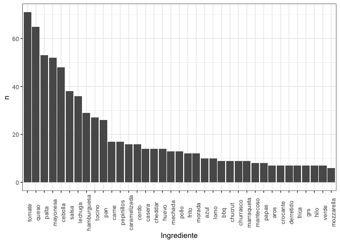<!-- -->

``` r
# Ahora filtraremos si la nota es menor a 3 y los comnetarios digan peor y malo.
df_3 = filter(DF,nota<3, suma2 == 2, suma1 == 0)

glimpse(df_3)
```

    ## Rows: 3
    ## Columns: 356
    ## $ url                   <chr> "https://365sanguchez.com/bucalemu-patagonia-fue…
    ## $ Local                 <chr> "Patagonia Fuente Austral", "El Dominguito", "En…
    ## $ Direccion             <chr> "Easton Outlet Mall, Av. Eduardo Frei Montalva 9…
    ## $ Precio                <int> 5900, 7200, 7900
    ## $ Ingredientes          <chr> "Mechada, champi\xf1ones salteados, tomate, r\xf…
    ## $ nota                  <int> 1, 1, 1
    ## $ Bueno                 <dbl> 0, 0, 0
    ## $ Rico                  <dbl> 0, 0, 0
    ## $ Malo                  <dbl> 1, 1, 1
    ## $ Peor                  <dbl> 1, 1, 1
    ## $ suma1                 <dbl> 0, 0, 0
    ## $ suma2                 <dbl> 2, 2, 2
    ## $ cantidad_ingredientes <dbl> 6, 4, 8
    ## $ tomate                <dbl> 0, 1, 0
    ## $ queso                 <dbl> 0, 0, 0
    ## $ palta                 <dbl> 0, 1, 0
    ## $ mayonesa              <dbl> 0, 1, 0
    ## $ cebolla               <dbl> 0, 0, 0
    ## $ salsa                 <dbl> 0, 0, 0
    ## $ lechuga               <dbl> 0, 0, 0
    ## $ hamburguesa           <dbl> 0, 0, 0
    ## $ tocino                <dbl> 0, 0, 0
    ## $ pan                   <dbl> 0, 0, 0
    ## $ pepinillos            <dbl> 0, 0, 0
    ## $ carne                 <dbl> 0, 1, 0
    ## $ cerdo                 <dbl> 0, 0, 0
    ## $ caramelizada          <dbl> 0, 0, 0
    ## $ casera                <dbl> 0, 0, 0
    ## $ cheddar               <dbl> 0, 0, 0
    ## $ huevo                 <dbl> 0, 0, 0
    ## $ mechada               <dbl> 0, 1, 0
    ## $ pollo                 <dbl> 0, 0, 0
    ## $ frito                 <dbl> 0, 0, 0
    ## $ morada                <dbl> 0, 0, 0
    ## $ azul                  <dbl> 0, 0, 0
    ## $ lomo                  <dbl> 0, 0, 0
    ## $ bbq                   <dbl> 0, 0, 0
    ## $ marraqueta            <dbl> 0, 0, 0
    ## $ chucrut               <dbl> 0, 0, 0
    ## $ churrasco             <dbl> 0, 0, 0
    ## $ mantecoso             <dbl> 0, 0, 0
    ## $ papas                 <dbl> 0, 0, 0
    ## $ crocante              <dbl> 0, 0, 0
    ## $ mozzarella            <dbl> 0, 0, 0
    ## $ hilo                  <dbl> 0, 0, 0
    ## $ aros                  <dbl> 0, 0, 0
    ## $ grs                   <dbl> 0, 0, 0
    ## $ verde                 <dbl> 0, 0, 0
    ## $ derretido             <dbl> 0, 0, 0
    ## $ frica                 <dbl> 0, 0, 0
    ## $ salchicha             <dbl> 0, 0, 0
    ## $ mostaza               <dbl> 0, 0, 0
    ## $ artesanal             <dbl> 0, 0, 0
    ## $ vacuno                <dbl> 0, 0, 0
    ## $ ciabatta              <dbl> 0, 0, 0
    ## $ mix                   <dbl> 0, 0, 0
    ## $ tomates               <dbl> 0, 0, 0
    ## $ casa                  <dbl> 0, 0, 0
    ## $ frita                 <dbl> 0, 0, 0
    ## $ pepinillo             <dbl> 0, 0, 0
    ## $ chilena               <dbl> 0, 0, 0
    ## $ pebre                 <dbl> 0, 0, 0
    ## $ verdes                <dbl> 0, 0, 0
    ## $ lomito                <dbl> 0, 0, 0
    ## $ albahaca              <dbl> 0, 0, 0
    ## $ coleslaw              <dbl> 0, 0, 0
    ## $ alioli                <dbl> 0, 0, 0
    ## $ asados                <dbl> 0, 0, 0
    ## $ americana             <dbl> 0, 0, 0
    ## $ manzana               <dbl> 0, 0, 0
    ## $ plancha               <dbl> 0, 0, 0
    ## $ filete                <dbl> 0, 0, 0
    ## $ wagyu                 <dbl> 0, 0, 0
    ## $ berros                <dbl> 0, 0, 0
    ## $ ciboulette            <dbl> 0, 0, 0
    ## $ ahumada               <dbl> 0, 1, 0
    ## $ doble                 <dbl> 0, 0, 0
    ## $ asado                 <dbl> 0, 0, 0
    ## $ ensalada              <dbl> 0, 0, 0
    ## $ quesos                <dbl> 0, 0, 0
    ## $ caramelizadas         <dbl> 0, 0, 0
    ## $ cordero               <dbl> 0, 0, 0
    ## $ pastelera             <dbl> 0, 0, 0
    ## $ choclo                <dbl> 0, 0, 0
    ## $ cilantro              <dbl> 0, 0, 0
    ## $ apanados              <dbl> 0, 0, 0
    ## $ fundido               <dbl> 0, 0, 0
    ## $ vegetariana           <dbl> 0, 0, 0
    ## $ casero                <dbl> 0, 0, 0
    ## $ chutney               <dbl> 0, 0, 0
    ## $ porotos               <dbl> 0, 0, 0
    ## $ roquefort             <dbl> 0, 0, 0
    ## $ saltado               <dbl> 0, 0, 0
    ## $ crema                 <dbl> 0, 0, 0
    ## $ dijon                 <dbl> 0, 0, 0
    ## $ chimichurri           <dbl> 0, 0, 0
    ## $ agregado              <dbl> 0, 0, 0
    ## $ angus                 <dbl> 0, 0, 0
    ## $ mayo                  <dbl> 0, 0, 0
    ## $ sriracha              <dbl> 0, 0, 0
    ## $ costillar             <dbl> 0, 0, 0
    ## $ desmenuzada           <dbl> 0, 0, 0
    ## $ cerveza               <dbl> 0, 0, 0
    ## $ burger                <dbl> 0, 0, 0
    ## $ gramos                <dbl> 0, 0, 0
    ## $ pescado               <dbl> 0, 0, 0
    ## $ posta                 <dbl> 0, 0, 0
    ## $ rosada                <dbl> 0, 0, 0
    ## $ cognac                <dbl> 0, 0, 0
    ## $ italiano              <dbl> 0, 0, 0
    ## $ ajo                   <dbl> 0, 0, 0
    ## $ brioche               <dbl> 0, 0, 0
    ## $ ahumado               <dbl> 0, 0, 0
    ## $ lactonesa             <dbl> 0, 0, 0
    ## $ panceta               <dbl> 0, 0, 0
    ## $ nueces                <dbl> 0, 0, 0
    ## $ guacamole             <dbl> 0, 0, 0
    ## $ prieta                <dbl> 0, 0, 0
    ## $ cabra                 <dbl> 0, 0, 0
    ## $ pimentones            <dbl> 0, 0, 0
    ## $ tostadas              <dbl> 0, 0, 0
    ## $ lengua                <dbl> 0, 0, 0
    ## $ berenjena             <dbl> 0, 0, 0
    ## $ hojas                 <dbl> 0, 0, 0
    ## $ soya                  <dbl> 0, 0, 0
    ## $ pechuga               <dbl> 0, 0, 0
    ## $ pernil                <dbl> 0, 0, 0
    ## $ molida                <dbl> 0, 0, 0
    ## $ chino                 <dbl> 0, 0, 0
    ## $ vapor                 <dbl> 0, 0, 0
    ## $ trozos                <dbl> 0, 0, 0
    ## $ crispy                <dbl> 0, 0, 0
    ## $ perejil               <dbl> 0, 0, 0
    ## $ punta                 <dbl> 0, 0, 0
    ## $ camembert             <dbl> 0, 0, 0
    ## $ apanado               <dbl> 0, 0, 0
    ## $ panko                 <dbl> 0, 0, 0
    ## $ chorizo               <dbl> 0, 0, 0
    ## $ braseado              <dbl> 0, 0, 0
    ## $ repollo               <dbl> 0, 0, 0
    ## $ agridulce             <dbl> 0, 0, 0
    ## $ naranja               <dbl> 0, 0, 0
    ## $ romero                <dbl> 0, 0, 0
    ## $ merluza               <dbl> 0, 0, 0
    ## $ anticuchera           <dbl> 0, 0, 0
    ## $ deshuesado            <dbl> 0, 0, 0
    ## $ marinado              <dbl> 0, 0, 0
    ## $ brie                  <dbl> 0, 0, 0
    ## $ mermelada             <dbl> 0, 0, 0
    ## $ amasado               <dbl> 0, 0, 0
    ## $ res                   <dbl> 0, 0, 0
    ## $ arrollado             <dbl> 0, 0, 0
    ## $ huaso                 <dbl> 0, 0, 0
    ## $ pepino                <dbl> 0, 0, 0
    ## $ caseros               <dbl> 0, 0, 0
    ## $ bondiola              <dbl> 0, 0, 0
    ## $ braseada              <dbl> 0, 0, 0
    ## $ codorniz              <dbl> 0, 0, 0
    ## $ portobello            <dbl> 0, 0, 0
    ## $ manzanas              <dbl> 0, 0, 0
    ## $ costillas             <dbl> 0, 0, 0
    ## $ barbecue              <dbl> 0, 0, 0
    ## $ cebollas              <dbl> 0, 0, 0
    ## $ lago                  <dbl> 0, 0, 0
    ## $ ranco                 <dbl> 0, 0, 0
    ## $ hummus                <dbl> 0, 0, 0
    ## $ panini                <dbl> 0, 0, 0
    ## $ viene                 <dbl> 0, 0, 0
    ## $ caldo                 <dbl> 0, 0, 0
    ## $ untar                 <dbl> 0, 0, 0
    ## $ habas                 <dbl> 0, 0, 0
    ## $ garbanzos             <dbl> 0, 0, 0
    ## $ campo                 <dbl> 0, 0, 0
    ## $ caldito               <dbl> 0, 0, 0
    ## $ confit                <dbl> 0, 0, 0
    ## $ grillada              <dbl> 0, 0, 0
    ## $ lentejas              <dbl> 0, 0, 0
    ## $ zanahoria             <dbl> 0, 0, 0
    ## $ avena                 <dbl> 0, 0, 0
    ## $ verduras              <dbl> 0, 0, 0
    ## $ wok                   <dbl> 0, 0, 0
    ## $ fresca                <dbl> 0, 0, 0
    ## $ kassler               <dbl> 0, 0, 0
    ## $ aceite                <dbl> 0, 0, 0
    ## $ oliva                 <dbl> 0, 0, 0
    ## $ secreta               <dbl> 0, 0, 0
    ## $ haussmann             <dbl> 0, 0, 0
    ## $ jengibre              <dbl> 0, 0, 0
    ## $ negros                <dbl> 0, 0, 0
    ## $ betarraga             <dbl> 0, 0, 0
    ## $ arroz                 <dbl> 0, 0, 0
    ## $ integral              <dbl> 0, 0, 0
    ## $ secretos              <dbl> 0, 0, 0
    ## $ vegetales             <dbl> 0, 0, 0
    ## $ grillados             <dbl> 0, 0, 0
    ## $ gratinado             <dbl> 0, 0, 0
    ## $ misuna                <dbl> 0, 0, 0
    ## $ blanco                <dbl> 0, 0, 0
    ## $ trufado               <dbl> 0, 0, 0
    ## $ sopaipillas           <dbl> 0, 0, 0
    ## $ quilicura             <dbl> 0, 0, 0
    ## $ querricura            <dbl> 0, 0, 0
    ## $ santiago              <dbl> 0, 0, 0
    ## $ barato                <dbl> 0, 0, 0
    ## $ as                    <dbl> 0, 0, 0
    ## $ completos             <dbl> 0, 0, 0
    ## $ lomitos               <dbl> 0, 0, 0
    ## $ frutillas             <dbl> 0, 0, 0
    ## $ grilladas             <dbl> 0, 0, 0
    ## $ lolo                  <dbl> 0, 0, 0
    ## $ green                 <dbl> 0, 0, 0
    ## $ masa                  <dbl> 0, 0, 0
    ## $ madre                 <dbl> 0, 0, 0
    ## $ salsita               <dbl> 0, 0, 0
    ## $ creo                  <dbl> 0, 0, 0
    ## $ zapallo               <dbl> 0, 0, 0
    ## $ rojos                 <dbl> 0, 0, 0
    ## $ baguette              <dbl> 0, 0, 0
    ## $ yogur                 <dbl> 0, 0, 0
    ## $ tempura               <dbl> 0, 0, 0
    ## $ asada                 <dbl> 0, 0, 0
    ## $ pastrami              <dbl> 0, 0, 0
    ## $ caliente              <dbl> 0, 0, 0
    ## $ `150`                 <dbl> 0, 0, 0
    ## $ chile                 <dbl> 0, 0, 0
    ## $ chilli                <dbl> 0, 0, 0
    ## $ cherry                <dbl> 0, 0, 0
    ## $ kiss                  <dbl> 0, 0, 0
    ## $ my                    <dbl> 0, 0, 0
    ## $ hass                  <dbl> 0, 0, 0
    ## $ fresquito             <dbl> 0, 0, 0
    ## $ buen                  <dbl> 0, 0, 0
    ## $ color                 <dbl> 0, 0, 0
    ## $ bien                  <dbl> 0, 0, 0
    ## $ jugoso                <dbl> 0, 0, 0
    ## $ buena                 <dbl> 0, 0, 0
    ## $ complementada         <dbl> 0, 0, 0
    ## $ poroto                <dbl> 0, 0, 0
    ## $ panita                <dbl> 0, 0, 0
    ## $ fritas                <dbl> 0, 0, 0
    ## $ relleno               <dbl> 0, 0, 0
    ## $ trocitos              <dbl> 0, 0, 0
    ## $ china                 <dbl> 0, 0, 0
    ## $ picante               <dbl> 0, 0, 0
    ## $ espinaca              <dbl> 0, 0, 0
    ## $ super                 <dbl> 0, 0, 0
    ## $ frank                 <dbl> 0, 0, 0
    ## $ alemana               <dbl> 0, 0, 0
    ## $ ketchup               <dbl> 0, 0, 0
    ## $ paleta                <dbl> 0, 0, 0
    ## $ ganso                 <dbl> 0, 0, 0
    ## $ encurtidos            <dbl> 0, 0, 0
    ## $ desmenuzado           <dbl> 0, 0, 0
    ## $ deshidratados         <dbl> 0, 0, 0
    ## $ cacerola              <dbl> 0, 0, 0
    ## $ papayas               <dbl> 0, 0, 0
    ## $ tiras                 <dbl> 0, 0, 0
    ## $ onion                 <dbl> 0, 0, 0
    ## $ rings                 <dbl> 0, 0, 0
    ## $ mezclada              <dbl> 0, 0, 0
    ## $ pimientos             <dbl> 0, 0, 0
    ## $ pasta                 <dbl> 0, 0, 0
    ## $ hallula               <dbl> 0, 0, 0
    ## $ pechito               <dbl> 0, 0, 0
    ## $ golden                <dbl> 0, 0, 0
    ## $ semillas              <dbl> 0, 0, 0
    ## $ camarones             <dbl> 0, 0, 0
    ## $ fritos                <dbl> 0, 0, 0
    ## $ sweet                 <dbl> 0, 0, 0
    ## $ chili                 <dbl> 0, 0, 0
    ## $ choripan              <dbl> 0, 0, 0
    ## $ cochayuyo             <dbl> 0, 0, 0
    ## $ griega                <dbl> 0, 0, 0
    ## $ llanero               <dbl> 0, 0, 0
    ## $ palmitos              <dbl> 0, 0, 0
    ## $ plateada              <dbl> 0, 0, 0
    ## $ rebosada              <dbl> 0, 0, 0
    ## $ ingredientes          <dbl> 0, 0, 0
    ## $ finas                 <dbl> 0, 0, 0
    ## $ lonjas                <dbl> 0, 0, 0
    ## $ pulpo                 <dbl> 0, 0, 0
    ## $ zarza                 <dbl> 0, 0, 0
    ## $ criolla               <dbl> 0, 0, 0
    ## $ chips                 <dbl> 0, 0, 0
    ## $ camote                <dbl> 0, 0, 0
    ## $ argentino             <dbl> 0, 0, 0
    ## $ vaca                  <dbl> 0, 0, 0
    ## $ hilachas              <dbl> 0, 0, 0
    ## $ pulpa                 <dbl> 0, 0, 0
    ## $ pera                  <dbl> 0, 0, 0
    ## $ maple                 <dbl> 0, 0, 0
    ## $ syrup                 <dbl> 0, 0, 0
    ## $ ojo                   <dbl> 0, 0, 0
    ## $ dulce                 <dbl> 0, 0, 0
    ## $ membrillo             <dbl> 0, 0, 0
    ## $ almendras             <dbl> 0, 0, 0
    ## $ choricillo            <dbl> 0, 0, 0
    ## $ chanchito             <dbl> 0, 0, 0
    ## $ revuelto              <dbl> 0, 0, 0
    ## $ dos                   <dbl> 0, 0, 0
    ## $ huevos                <dbl> 0, 0, 0
    ## $ planchados            <dbl> 0, 0, 0
    ## $ mini                  <dbl> 0, 0, 0
    ## $ marraquetitas         <dbl> 0, 0, 0
    ## $ eneldo                <dbl> 0, 0, 0
    ## $ liso                  <dbl> 0, 0, 0
    ## $ anillos               <dbl> 0, 0, 0
    ## $ confitado             <dbl> 0, 0, 0
    ## $ negro                 <dbl> 0, 0, 0
    ## $ miga                  <dbl> 0, 0, 0
    ## $ deshilachada          <dbl> 0, 0, 0
    ## $ pale                  <dbl> 0, 0, 0
    ## $ ale                   <dbl> 0, 0, 0
    ## $ yogurt                <dbl> 0, 0, 0
    ## $ mantequilla           <dbl> 0, 0, 0
    ## $ venezolanos           <dbl> 0, 0, 0
    ## $ calafate              <dbl> 0, 0, 0
    ## $ croqueta              <dbl> 0, 0, 0
    ## $ quinoa                <dbl> 0, 0, 0
    ## $ zuccini               <dbl> 0, 0, 0
    ## $ hamburguesas          <dbl> 0, 0, 0
    ## $ mezcla                <dbl> 0, 0, 0
    ## $ foie                  <dbl> 0, 0, 0
    ## $ gras                  <dbl> 0, 0, 0
    ## $ papa                  <dbl> 0, 0, 0
    ## $ austral               <dbl> 0, 0, 0
    ## $ especias              <dbl> 0, 0, 0
    ## $ apio                  <dbl> 0, 0, 0
    ## $ vietnamita            <dbl> 0, 0, 0
    ## $ tortilla              <dbl> 0, 0, 0
    ## $ amasada               <dbl> 0, 0, 0
    ## $ pepper                <dbl> 0, 0, 0
    ## $ jack                  <dbl> 0, 0, 0
    ## $ bourbon               <dbl> 0, 0, 0
    ## $ pesto                 <dbl> 0, 0, 0
    ## $ seco                  <dbl> 0, 0, 0
    ## $ milanesa              <dbl> 0, 0, 0
    ## $ huerto                <dbl> 0, 0, 0
    ## $ amigo                 <dbl> 0, 0, 0
    ## $ dulces                <dbl> 0, 0, 0
    ## $ morado                <dbl> 0, 0, 0
    ## $ bagel                 <dbl> 0, 0, 0
    ## $ cubierta              <dbl> 0, 0, 0
    ## $ pickle                <dbl> 0, 0, 0
    ## $ potito                <dbl> 0, 0, 0
    ## $ longaniza             <dbl> 0, 0, 0
    ## $ trutro                <dbl> 0, 0, 0
    ## $ grillado              <dbl> 0, 0, 0
    ## $ crujiente             <dbl> 0, 0, 0
    ## $ cheeseburger          <dbl> 0, 0, 0
    ## $ spicy                 <dbl> 0, 0, 0
    ## $ rostizada             <dbl> 0, 0, 0
    ## $ rellena               <dbl> 0, 0, 0
    ## $ croquetas             <dbl> 0, 0, 0
    ## $ palmito               <dbl> 0, 0, 0
    ## $ chedar                <dbl> 0, 0, 0

``` r
df_3[,c(14:50)] %>%
  gather(key = "variable", value = "valor") %>%
  filter(valor != 0) %>% group_by(variable) %>%
  count() %>% 
  ggplot(aes(x =  reorder(variable, desc(n)), y = n)) +
  geom_col() +
  theme_bw() +
  labs(x = "Ingrediente") +
  theme(axis.text.x = element_text(angle = 90))
```

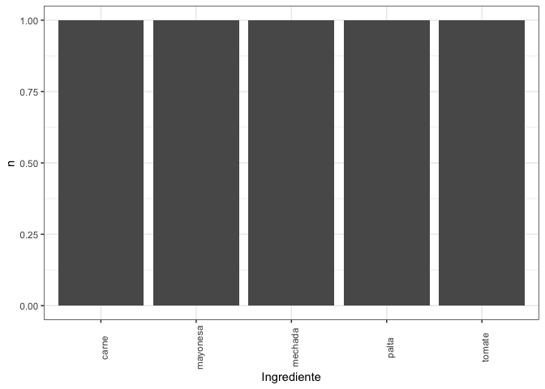<!-- -->

``` r
# Ahora filtraremos si la nota es mayor a 3 y los comnetarios digan bueno y rico.
df_4 = filter(DF,nota>3, suma1 == 2, suma2 == 0)

glimpse(df_4)
```

    ## Rows: 31
    ## Columns: 356
    ## $ url                   <chr> "https://365sanguchez.com/aldea-nativa-providenc…
    ## $ Local                 <chr> "Aldea Nativa", "A Mano Gin and Burguers", "Bar …
    ## $ Direccion             <chr> "Tobalaba 1799, Providencia, Regi\xf3n Metropoli…
    ## $ Precio                <int> 4900, 8900, 8900, 6800, 5900, 10700, 6100, 5500,…
    ## $ Ingredientes          <chr> "Tofu asado no transg\xe9nico, palta, tomate, ch…
    ## $ nota                  <int> 4, 4, 4, 4, 5, 4, 4, 5, 4, 5, 4, 4, 5, 4, 4, 5, …
    ## $ Bueno                 <dbl> 1, 1, 1, 1, 1, 1, 1, 1, 1, 1, 1, 1, 1, 1, 1, 1, …
    ## $ Rico                  <dbl> 1, 1, 1, 1, 1, 1, 1, 1, 1, 1, 1, 1, 1, 1, 1, 1, …
    ## $ Malo                  <dbl> 0, 0, 0, 0, 0, 0, 0, 0, 0, 0, 0, 0, 0, 0, 0, 0, …
    ## $ Peor                  <dbl> 0, 0, 0, 0, 0, 0, 0, 0, 0, 0, 0, 0, 0, 0, 0, 0, …
    ## $ suma1                 <dbl> 2, 2, 2, 2, 2, 2, 2, 2, 2, 2, 2, 2, 2, 2, 2, 2, …
    ## $ suma2                 <dbl> 0, 0, 0, 0, 0, 0, 0, 0, 0, 0, 0, 0, 0, 0, 0, 0, …
    ## $ cantidad_ingredientes <dbl> 6, 6, 5, 5, 7, 7, 8, 7, 6, 5, 4, 6, 6, 5, 8, 5, …
    ## $ tomate                <dbl> 0, 0, 0, 0, 0, 0, 0, 0, 0, 0, 1, 0, 0, 0, 0, 0, …
    ## $ queso                 <dbl> 0, 0, 1, 0, 0, 0, 0, 0, 1, 0, 0, 0, 0, 1, 0, 0, …
    ## $ palta                 <dbl> 0, 0, 0, 0, 0, 0, 0, 0, 0, 0, 1, 0, 0, 0, 0, 0, …
    ## $ mayonesa              <dbl> 0, 0, 0, 0, 0, 0, 0, 0, 1, 0, 1, 0, 0, 0, 0, 0, …
    ## $ cebolla               <dbl> 0, 0, 0, 0, 0, 0, 0, 0, 0, 0, 0, 0, 0, 1, 0, 1, …
    ## $ salsa                 <dbl> 0, 0, 0, 0, 0, 0, 0, 0, 0, 0, 0, 0, 0, 0, 0, 0, …
    ## $ lechuga               <dbl> 0, 0, 0, 0, 0, 0, 0, 0, 1, 0, 0, 0, 0, 0, 0, 0, …
    ## $ hamburguesa           <dbl> 0, 0, 0, 0, 0, 0, 0, 0, 1, 0, 0, 0, 0, 0, 0, 0, …
    ## $ tocino                <dbl> 0, 0, 1, 0, 0, 0, 0, 0, 0, 0, 0, 0, 0, 0, 0, 0, …
    ## $ pan                   <dbl> 0, 0, 0, 0, 0, 0, 0, 0, 0, 0, 0, 0, 0, 0, 0, 0, …
    ## $ pepinillos            <dbl> 0, 0, 0, 0, 0, 0, 0, 0, 0, 0, 0, 0, 0, 0, 0, 0, …
    ## $ carne                 <dbl> 0, 0, 0, 0, 0, 0, 0, 0, 0, 0, 0, 0, 0, 0, 0, 0, …
    ## $ cerdo                 <dbl> 0, 0, 0, 0, 0, 0, 0, 0, 0, 0, 0, 0, 0, 0, 0, 0, …
    ## $ caramelizada          <dbl> 0, 0, 0, 0, 0, 0, 0, 0, 0, 0, 0, 0, 0, 1, 0, 0, …
    ## $ casera                <dbl> 0, 0, 0, 0, 0, 0, 0, 0, 1, 0, 1, 0, 0, 0, 0, 0, …
    ## $ cheddar               <dbl> 0, 0, 0, 0, 0, 0, 0, 0, 0, 0, 0, 0, 0, 0, 0, 0, …
    ## $ huevo                 <dbl> 0, 0, 1, 0, 0, 0, 0, 0, 0, 0, 0, 0, 0, 0, 0, 1, …
    ## $ mechada               <dbl> 0, 0, 0, 0, 0, 0, 0, 0, 0, 0, 0, 0, 0, 0, 0, 0, …
    ## $ pollo                 <dbl> 0, 0, 0, 0, 0, 0, 0, 0, 0, 0, 0, 0, 0, 0, 0, 0, …
    ## $ frito                 <dbl> 0, 0, 0, 0, 0, 0, 0, 0, 0, 0, 0, 0, 0, 0, 0, 1, …
    ## $ morada                <dbl> 0, 0, 0, 0, 0, 0, 0, 0, 0, 0, 0, 0, 0, 0, 0, 0, …
    ## $ azul                  <dbl> 0, 0, 1, 0, 0, 0, 0, 0, 1, 0, 0, 0, 0, 1, 0, 0, …
    ## $ lomo                  <dbl> 0, 0, 0, 0, 0, 0, 0, 0, 0, 0, 0, 0, 0, 0, 0, 0, …
    ## $ bbq                   <dbl> 0, 0, 0, 0, 0, 0, 0, 0, 0, 0, 0, 0, 0, 0, 0, 0, …
    ## $ marraqueta            <dbl> 0, 0, 0, 0, 0, 0, 0, 0, 0, 0, 0, 0, 0, 0, 0, 0, …
    ## $ chucrut               <dbl> 0, 0, 0, 0, 0, 0, 0, 0, 0, 0, 0, 0, 0, 0, 0, 0, …
    ## $ churrasco             <dbl> 0, 0, 0, 0, 0, 0, 0, 0, 0, 0, 0, 0, 0, 0, 0, 0, …
    ## $ mantecoso             <dbl> 0, 0, 0, 0, 0, 0, 0, 0, 0, 0, 0, 0, 0, 0, 0, 0, …
    ## $ papas                 <dbl> 0, 0, 0, 0, 0, 0, 0, 0, 0, 0, 0, 0, 0, 0, 0, 1, …
    ## $ crocante              <dbl> 0, 0, 0, 0, 0, 0, 0, 0, 0, 0, 0, 0, 0, 0, 0, 0, …
    ## $ mozzarella            <dbl> 0, 0, 2, 0, 0, 0, 0, 0, 0, 0, 0, 0, 0, 0, 0, 0, …
    ## $ hilo                  <dbl> 0, 0, 0, 0, 0, 0, 0, 0, 0, 0, 0, 0, 0, 0, 0, 1, …
    ## $ aros                  <dbl> 0, 0, 0, 0, 0, 0, 0, 0, 0, 0, 0, 0, 0, 0, 0, 0, …
    ## $ grs                   <dbl> 0, 0, 0, 0, 0, 0, 0, 0, 1, 0, 0, 0, 0, 0, 0, 0, …
    ## $ verde                 <dbl> 0, 0, 0, 0, 0, 0, 0, 0, 0, 0, 0, 0, 0, 0, 0, 0, …
    ## $ derretido             <dbl> 0, 0, 0, 0, 0, 0, 0, 0, 0, 0, 0, 0, 0, 0, 0, 0, …
    ## $ frica                 <dbl> 0, 0, 0, 0, 0, 0, 0, 0, 0, 0, 0, 0, 0, 0, 0, 0, …
    ## $ salchicha             <dbl> 0, 0, 0, 0, 0, 0, 0, 0, 0, 0, 0, 0, 0, 0, 0, 0, …
    ## $ mostaza               <dbl> 0, 0, 0, 0, 0, 0, 0, 0, 0, 0, 0, 0, 0, 1, 0, 0, …
    ## $ artesanal             <dbl> 0, 0, 0, 0, 0, 0, 0, 0, 0, 0, 0, 0, 0, 0, 0, 0, …
    ## $ vacuno                <dbl> 0, 0, 0, 0, 0, 0, 0, 0, 0, 0, 0, 0, 0, 0, 0, 1, …
    ## $ ciabatta              <dbl> 0, 0, 0, 0, 0, 0, 0, 0, 0, 0, 0, 0, 0, 0, 0, 0, …
    ## $ mix                   <dbl> 0, 0, 0, 0, 0, 0, 0, 0, 0, 0, 0, 0, 0, 0, 0, 0, …
    ## $ tomates               <dbl> 0, 0, 0, 0, 0, 0, 0, 0, 0, 0, 0, 0, 0, 0, 0, 0, …
    ## $ casa                  <dbl> 0, 0, 0, 0, 0, 0, 0, 0, 0, 0, 0, 0, 0, 0, 0, 0, …
    ## $ frita                 <dbl> 0, 0, 0, 0, 0, 0, 0, 0, 0, 0, 0, 0, 0, 0, 0, 0, …
    ## $ pepinillo             <dbl> 0, 0, 0, 0, 0, 0, 0, 0, 0, 0, 0, 0, 0, 1, 0, 0, …
    ## $ chilena               <dbl> 0, 0, 0, 0, 0, 0, 0, 0, 0, 0, 0, 0, 0, 0, 0, 0, …
    ## $ pebre                 <dbl> 0, 0, 0, 0, 0, 0, 0, 0, 0, 0, 0, 0, 0, 0, 0, 0, …
    ## $ verdes                <dbl> 0, 0, 0, 0, 0, 0, 0, 0, 0, 0, 0, 0, 0, 0, 0, 0, …
    ## $ lomito                <dbl> 0, 0, 0, 0, 0, 0, 0, 0, 0, 0, 0, 0, 0, 0, 0, 0, …
    ## $ albahaca              <dbl> 0, 0, 0, 0, 0, 0, 0, 0, 0, 0, 0, 0, 0, 0, 0, 0, …
    ## $ coleslaw              <dbl> 0, 0, 0, 0, 0, 0, 0, 0, 0, 0, 0, 0, 0, 0, 0, 0, …
    ## $ alioli                <dbl> 0, 0, 0, 0, 0, 0, 0, 0, 0, 0, 0, 0, 0, 0, 0, 0, …
    ## $ asados                <dbl> 0, 0, 0, 0, 0, 0, 0, 0, 0, 0, 0, 0, 0, 0, 0, 0, …
    ## $ americana             <dbl> 0, 0, 0, 0, 0, 0, 0, 0, 0, 0, 0, 0, 0, 0, 0, 0, …
    ## $ manzana               <dbl> 0, 0, 0, 0, 0, 0, 0, 0, 0, 0, 0, 0, 0, 0, 0, 0, …
    ## $ plancha               <dbl> 0, 0, 0, 0, 0, 0, 0, 0, 0, 0, 0, 0, 0, 0, 0, 0, …
    ## $ filete                <dbl> 0, 0, 0, 0, 0, 0, 0, 0, 0, 0, 0, 0, 0, 0, 0, 0, …
    ## $ wagyu                 <dbl> 0, 0, 0, 0, 0, 0, 0, 0, 0, 0, 0, 0, 0, 0, 0, 0, …
    ## $ berros                <dbl> 0, 0, 0, 0, 0, 0, 0, 0, 0, 0, 0, 0, 0, 0, 0, 0, …
    ## $ ciboulette            <dbl> 0, 0, 0, 0, 0, 0, 0, 0, 0, 0, 0, 0, 0, 0, 0, 0, …
    ## $ ahumada               <dbl> 0, 0, 0, 0, 0, 0, 0, 0, 0, 0, 0, 0, 0, 0, 0, 0, …
    ## $ doble                 <dbl> 0, 0, 0, 0, 0, 0, 0, 0, 0, 0, 0, 0, 0, 0, 0, 0, …
    ## $ asado                 <dbl> 0, 0, 0, 0, 0, 0, 0, 0, 0, 0, 0, 0, 0, 0, 0, 0, …
    ## $ ensalada              <dbl> 0, 0, 0, 0, 0, 0, 0, 0, 0, 0, 0, 0, 0, 0, 0, 0, …
    ## $ quesos                <dbl> 0, 0, 0, 0, 0, 0, 0, 0, 0, 0, 0, 0, 0, 0, 0, 0, …
    ## $ caramelizadas         <dbl> 0, 0, 1, 0, 0, 0, 0, 0, 1, 0, 0, 0, 0, 0, 0, 0, …
    ## $ cordero               <dbl> 0, 0, 0, 0, 0, 0, 0, 0, 0, 0, 0, 0, 0, 1, 0, 0, …
    ## $ pastelera             <dbl> 0, 0, 0, 0, 0, 0, 0, 0, 0, 0, 0, 0, 0, 0, 0, 1, …
    ## $ choclo                <dbl> 0, 0, 0, 0, 0, 0, 0, 0, 0, 0, 0, 0, 0, 0, 0, 1, …
    ## $ cilantro              <dbl> 0, 0, 0, 0, 0, 0, 0, 0, 0, 0, 0, 0, 0, 0, 0, 0, …
    ## $ apanados              <dbl> 0, 0, 0, 0, 0, 0, 0, 0, 0, 0, 0, 0, 0, 0, 0, 0, …
    ## $ fundido               <dbl> 0, 0, 0, 0, 0, 0, 0, 0, 0, 0, 0, 0, 0, 0, 0, 0, …
    ## $ vegetariana           <dbl> 0, 0, 0, 0, 0, 0, 0, 0, 0, 0, 0, 0, 0, 0, 0, 0, …
    ## $ casero                <dbl> 0, 0, 0, 0, 0, 0, 0, 0, 0, 0, 0, 0, 0, 0, 0, 0, …
    ## $ chutney               <dbl> 0, 0, 0, 0, 0, 0, 0, 0, 0, 0, 0, 0, 0, 0, 0, 0, …
    ## $ porotos               <dbl> 0, 0, 0, 0, 0, 0, 0, 0, 0, 0, 0, 0, 0, 0, 0, 0, …
    ## $ roquefort             <dbl> 0, 0, 0, 0, 0, 0, 0, 0, 0, 0, 0, 0, 0, 0, 0, 0, …
    ## $ saltado               <dbl> 0, 0, 0, 0, 0, 0, 0, 0, 0, 0, 0, 0, 0, 0, 0, 0, …
    ## $ crema                 <dbl> 0, 0, 0, 0, 0, 0, 0, 0, 0, 0, 0, 0, 0, 0, 0, 0, …
    ## $ dijon                 <dbl> 0, 0, 0, 0, 0, 0, 0, 0, 0, 0, 0, 0, 0, 1, 0, 0, …
    ## $ chimichurri           <dbl> 0, 0, 0, 0, 0, 0, 0, 0, 0, 0, 0, 0, 0, 0, 0, 0, …
    ## $ agregado              <dbl> 0, 0, 0, 0, 0, 0, 0, 0, 0, 0, 0, 0, 0, 0, 0, 0, …
    ## $ angus                 <dbl> 0, 0, 0, 0, 0, 0, 0, 0, 0, 0, 0, 0, 0, 0, 0, 0, …
    ## $ mayo                  <dbl> 0, 0, 0, 0, 0, 0, 0, 0, 0, 0, 0, 0, 0, 0, 0, 0, …
    ## $ sriracha              <dbl> 0, 0, 0, 0, 0, 0, 0, 0, 0, 0, 0, 0, 0, 0, 0, 0, …
    ## $ costillar             <dbl> 0, 0, 0, 0, 0, 0, 0, 0, 0, 0, 0, 0, 0, 0, 0, 0, …
    ## $ desmenuzada           <dbl> 0, 0, 0, 0, 0, 0, 0, 0, 0, 0, 0, 0, 0, 0, 0, 0, …
    ## $ cerveza               <dbl> 0, 0, 0, 0, 0, 0, 0, 0, 0, 0, 0, 0, 0, 0, 0, 0, …
    ## $ burger                <dbl> 0, 0, 0, 0, 0, 0, 0, 0, 0, 0, 0, 0, 0, 0, 0, 0, …
    ## $ gramos                <dbl> 0, 0, 0, 0, 0, 0, 0, 0, 0, 0, 0, 0, 0, 0, 0, 0, …
    ## $ pescado               <dbl> 0, 0, 0, 0, 0, 0, 0, 0, 0, 0, 0, 0, 0, 0, 0, 0, …
    ## $ posta                 <dbl> 0, 0, 0, 0, 0, 0, 0, 0, 0, 0, 0, 0, 0, 0, 0, 0, …
    ## $ rosada                <dbl> 0, 0, 0, 0, 0, 0, 0, 0, 0, 0, 0, 0, 0, 0, 0, 0, …
    ## $ cognac                <dbl> 0, 0, 0, 0, 0, 0, 0, 0, 0, 0, 0, 0, 0, 0, 0, 0, …
    ## $ italiano              <dbl> 0, 0, 0, 0, 0, 0, 0, 0, 0, 0, 0, 0, 0, 0, 0, 0, …
    ## $ ajo                   <dbl> 0, 0, 0, 0, 0, 0, 0, 0, 0, 0, 0, 0, 0, 0, 0, 0, …
    ## $ brioche               <dbl> 0, 0, 0, 0, 0, 0, 0, 0, 0, 0, 0, 0, 0, 0, 0, 0, …
    ## $ ahumado               <dbl> 0, 0, 0, 0, 0, 0, 0, 0, 0, 0, 0, 0, 0, 0, 0, 0, …
    ## $ lactonesa             <dbl> 0, 0, 0, 0, 0, 0, 0, 0, 0, 0, 0, 0, 0, 0, 0, 0, …
    ## $ panceta               <dbl> 0, 0, 0, 0, 0, 0, 0, 0, 0, 0, 0, 0, 0, 0, 0, 0, …
    ## $ nueces                <dbl> 0, 0, 0, 0, 0, 0, 0, 0, 1, 0, 0, 0, 0, 0, 0, 0, …
    ## $ guacamole             <dbl> 0, 0, 0, 0, 0, 0, 0, 0, 0, 0, 0, 0, 0, 0, 0, 0, …
    ## $ prieta                <dbl> 0, 0, 0, 0, 0, 0, 0, 0, 0, 0, 0, 0, 0, 0, 0, 0, …
    ## $ cabra                 <dbl> 0, 0, 0, 0, 0, 0, 0, 0, 0, 0, 0, 0, 0, 0, 0, 0, …
    ## $ pimentones            <dbl> 0, 0, 0, 0, 0, 0, 0, 0, 0, 0, 0, 0, 0, 0, 0, 0, …
    ## $ tostadas              <dbl> 0, 0, 0, 0, 0, 0, 0, 0, 0, 0, 0, 0, 0, 0, 0, 0, …
    ## $ lengua                <dbl> 0, 0, 0, 0, 0, 0, 0, 0, 0, 0, 0, 0, 0, 0, 0, 0, …
    ## $ berenjena             <dbl> 0, 0, 0, 0, 0, 0, 0, 0, 0, 0, 0, 0, 0, 0, 0, 0, …
    ## $ hojas                 <dbl> 0, 0, 0, 0, 0, 0, 0, 0, 0, 0, 0, 0, 0, 0, 0, 0, …
    ## $ soya                  <dbl> 0, 0, 0, 0, 0, 0, 0, 0, 0, 0, 0, 0, 0, 0, 0, 0, …
    ## $ pechuga               <dbl> 0, 0, 0, 0, 0, 0, 0, 0, 0, 0, 0, 0, 0, 0, 0, 0, …
    ## $ pernil                <dbl> 0, 0, 0, 0, 0, 0, 0, 0, 0, 0, 0, 0, 0, 0, 0, 0, …
    ## $ molida                <dbl> 0, 0, 0, 0, 0, 0, 0, 0, 0, 0, 1, 0, 0, 0, 0, 0, …
    ## $ chino                 <dbl> 0, 0, 0, 0, 0, 0, 0, 0, 0, 0, 0, 0, 0, 0, 0, 0, …
    ## $ vapor                 <dbl> 0, 0, 0, 0, 0, 0, 0, 0, 0, 0, 0, 0, 0, 0, 0, 0, …
    ## $ trozos                <dbl> 0, 0, 0, 0, 0, 0, 0, 0, 0, 0, 0, 0, 0, 0, 0, 0, …
    ## $ crispy                <dbl> 0, 0, 0, 0, 0, 0, 0, 0, 0, 0, 0, 0, 0, 0, 0, 0, …
    ## $ perejil               <dbl> 0, 0, 0, 0, 0, 0, 0, 0, 0, 0, 0, 0, 0, 0, 0, 0, …
    ## $ punta                 <dbl> 0, 0, 0, 0, 0, 0, 0, 0, 0, 0, 0, 0, 0, 0, 0, 0, …
    ## $ camembert             <dbl> 0, 0, 0, 0, 0, 0, 0, 0, 0, 0, 0, 0, 0, 0, 0, 0, …
    ## $ apanado               <dbl> 0, 0, 0, 0, 0, 0, 0, 0, 0, 0, 0, 0, 0, 0, 0, 0, …
    ## $ panko                 <dbl> 0, 0, 0, 0, 0, 0, 0, 0, 0, 0, 0, 0, 0, 0, 0, 0, …
    ## $ chorizo               <dbl> 0, 0, 0, 0, 0, 0, 0, 0, 0, 0, 0, 0, 0, 0, 0, 0, …
    ## $ braseado              <dbl> 0, 0, 0, 0, 0, 0, 0, 0, 0, 0, 0, 0, 0, 1, 0, 0, …
    ## $ repollo               <dbl> 0, 0, 0, 0, 0, 0, 0, 0, 0, 0, 0, 0, 0, 0, 0, 0, …
    ## $ agridulce             <dbl> 0, 0, 0, 0, 0, 0, 0, 0, 0, 0, 0, 0, 0, 0, 0, 0, …
    ## $ naranja               <dbl> 0, 0, 0, 0, 0, 0, 0, 0, 0, 0, 0, 0, 0, 0, 0, 0, …
    ## $ romero                <dbl> 0, 0, 0, 0, 0, 0, 0, 0, 0, 0, 0, 0, 0, 0, 0, 0, …
    ## $ merluza               <dbl> 0, 0, 0, 0, 0, 0, 0, 0, 0, 0, 0, 0, 0, 0, 0, 0, …
    ## $ anticuchera           <dbl> 0, 0, 0, 0, 0, 0, 0, 0, 0, 0, 0, 0, 0, 0, 0, 0, …
    ## $ deshuesado            <dbl> 0, 0, 0, 0, 0, 0, 0, 0, 0, 0, 0, 0, 0, 0, 0, 0, …
    ## $ marinado              <dbl> 0, 0, 0, 0, 0, 0, 0, 0, 0, 0, 0, 0, 0, 0, 0, 0, …
    ## $ brie                  <dbl> 0, 0, 0, 0, 0, 0, 0, 0, 0, 0, 0, 0, 0, 0, 0, 0, …
    ## $ mermelada             <dbl> 0, 0, 0, 0, 0, 0, 0, 0, 0, 0, 0, 0, 0, 0, 0, 0, …
    ## $ amasado               <dbl> 0, 0, 0, 0, 0, 0, 0, 0, 0, 0, 0, 0, 0, 0, 0, 0, …
    ## $ res                   <dbl> 0, 0, 0, 0, 0, 0, 0, 0, 0, 0, 0, 0, 0, 0, 0, 0, …
    ## $ arrollado             <dbl> 0, 0, 0, 0, 0, 0, 0, 0, 0, 0, 0, 0, 0, 0, 0, 0, …
    ## $ huaso                 <dbl> 0, 0, 0, 0, 0, 0, 0, 0, 0, 0, 0, 0, 0, 0, 0, 0, …
    ## $ pepino                <dbl> 0, 0, 0, 0, 0, 0, 0, 0, 0, 0, 0, 0, 0, 0, 0, 0, …
    ## $ caseros               <dbl> 0, 0, 0, 0, 0, 0, 0, 0, 0, 0, 0, 0, 0, 0, 0, 0, …
    ## $ bondiola              <dbl> 0, 0, 0, 0, 0, 0, 0, 0, 0, 0, 0, 0, 0, 0, 0, 0, …
    ## $ braseada              <dbl> 0, 0, 0, 0, 0, 0, 0, 0, 0, 0, 0, 0, 0, 0, 0, 0, …
    ## $ codorniz              <dbl> 0, 0, 1, 0, 0, 0, 0, 0, 0, 0, 0, 0, 0, 0, 0, 0, …
    ## $ portobello            <dbl> 0, 0, 1, 0, 0, 0, 0, 0, 0, 0, 0, 0, 0, 0, 0, 0, …
    ## $ manzanas              <dbl> 0, 0, 1, 0, 0, 0, 0, 0, 0, 0, 0, 0, 0, 0, 0, 0, …
    ## $ costillas             <dbl> 0, 0, 0, 0, 0, 0, 0, 0, 0, 0, 0, 0, 0, 0, 0, 0, …
    ## $ barbecue              <dbl> 0, 0, 0, 0, 0, 0, 0, 0, 0, 0, 0, 0, 0, 0, 0, 0, …
    ## $ cebollas              <dbl> 0, 0, 0, 0, 0, 0, 0, 0, 0, 0, 0, 0, 0, 0, 0, 0, …
    ## $ lago                  <dbl> 0, 0, 0, 0, 0, 0, 0, 0, 0, 0, 0, 0, 0, 0, 0, 0, …
    ## $ ranco                 <dbl> 0, 0, 0, 0, 0, 0, 0, 0, 0, 0, 0, 0, 0, 0, 0, 0, …
    ## $ hummus                <dbl> 0, 0, 0, 0, 0, 0, 0, 0, 0, 0, 0, 0, 0, 0, 0, 0, …
    ## $ panini                <dbl> 0, 0, 0, 0, 0, 0, 0, 0, 0, 0, 0, 0, 0, 0, 0, 0, …
    ## $ viene                 <dbl> 0, 0, 0, 0, 0, 0, 0, 0, 0, 0, 0, 0, 0, 0, 0, 0, …
    ## $ caldo                 <dbl> 0, 0, 0, 0, 0, 0, 0, 0, 0, 0, 0, 0, 0, 0, 0, 0, …
    ## $ untar                 <dbl> 0, 0, 0, 0, 0, 0, 0, 0, 0, 0, 0, 0, 0, 0, 0, 0, …
    ## $ habas                 <dbl> 0, 0, 0, 0, 0, 0, 0, 0, 0, 0, 0, 0, 0, 0, 0, 0, …
    ## $ garbanzos             <dbl> 0, 0, 0, 0, 0, 0, 0, 0, 0, 0, 0, 0, 0, 0, 0, 0, …
    ## $ campo                 <dbl> 0, 0, 0, 0, 0, 0, 0, 0, 0, 0, 0, 0, 0, 0, 0, 0, …
    ## $ caldito               <dbl> 0, 0, 0, 0, 0, 0, 0, 0, 0, 0, 0, 0, 0, 0, 0, 0, …
    ## $ confit                <dbl> 0, 0, 0, 0, 0, 0, 0, 0, 0, 0, 0, 0, 0, 0, 0, 0, …
    ## $ grillada              <dbl> 0, 0, 0, 0, 0, 0, 0, 0, 0, 0, 0, 0, 0, 0, 0, 0, …
    ## $ lentejas              <dbl> 0, 0, 0, 0, 0, 0, 0, 0, 0, 0, 0, 0, 0, 0, 0, 0, …
    ## $ zanahoria             <dbl> 0, 0, 0, 0, 0, 0, 0, 0, 0, 0, 0, 0, 0, 0, 0, 0, …
    ## $ avena                 <dbl> 0, 0, 0, 0, 0, 0, 0, 0, 0, 0, 0, 0, 0, 0, 0, 0, …
    ## $ verduras              <dbl> 0, 0, 0, 0, 0, 0, 0, 0, 0, 0, 0, 0, 0, 0, 0, 0, …
    ## $ wok                   <dbl> 0, 0, 0, 0, 0, 0, 0, 0, 0, 0, 0, 0, 0, 0, 0, 0, …
    ## $ fresca                <dbl> 0, 0, 0, 0, 0, 0, 0, 0, 0, 0, 0, 0, 0, 0, 0, 0, …
    ## $ kassler               <dbl> 0, 0, 0, 0, 0, 0, 0, 0, 0, 0, 0, 0, 0, 0, 0, 0, …
    ## $ aceite                <dbl> 0, 0, 0, 0, 0, 0, 0, 0, 0, 0, 0, 0, 0, 0, 0, 0, …
    ## $ oliva                 <dbl> 0, 0, 0, 0, 0, 0, 0, 0, 0, 0, 0, 0, 0, 0, 0, 0, …
    ## $ secreta               <dbl> 0, 0, 0, 0, 0, 0, 0, 0, 0, 0, 0, 0, 0, 0, 0, 0, …
    ## $ haussmann             <dbl> 0, 0, 0, 0, 0, 0, 0, 0, 0, 0, 0, 0, 0, 0, 0, 0, …
    ## $ jengibre              <dbl> 0, 0, 0, 0, 0, 0, 0, 0, 0, 0, 0, 0, 0, 0, 0, 0, …
    ## $ negros                <dbl> 0, 0, 0, 0, 0, 0, 0, 0, 0, 0, 0, 0, 0, 0, 0, 0, …
    ## $ betarraga             <dbl> 0, 0, 0, 0, 0, 0, 0, 0, 0, 0, 0, 0, 0, 0, 0, 0, …
    ## $ arroz                 <dbl> 0, 0, 0, 0, 0, 0, 0, 0, 0, 0, 0, 0, 0, 0, 0, 0, …
    ## $ integral              <dbl> 0, 0, 0, 0, 0, 0, 0, 0, 0, 0, 0, 0, 0, 0, 0, 0, …
    ## $ secretos              <dbl> 0, 0, 0, 0, 0, 0, 0, 0, 0, 0, 0, 0, 0, 0, 0, 0, …
    ## $ vegetales             <dbl> 0, 0, 0, 0, 0, 0, 0, 0, 0, 0, 0, 0, 0, 0, 0, 0, …
    ## $ grillados             <dbl> 0, 0, 0, 0, 0, 0, 0, 0, 0, 0, 0, 0, 0, 0, 0, 0, …
    ## $ gratinado             <dbl> 0, 0, 0, 0, 0, 0, 0, 0, 0, 0, 0, 0, 0, 0, 0, 0, …
    ## $ misuna                <dbl> 0, 0, 0, 0, 0, 0, 0, 0, 0, 0, 0, 0, 0, 0, 0, 0, …
    ## $ blanco                <dbl> 0, 0, 0, 0, 0, 0, 0, 0, 0, 0, 0, 0, 0, 0, 0, 0, …
    ## $ trufado               <dbl> 0, 0, 0, 0, 0, 0, 0, 0, 0, 0, 0, 0, 0, 0, 0, 0, …
    ## $ sopaipillas           <dbl> 0, 0, 0, 0, 0, 0, 0, 0, 0, 0, 0, 0, 0, 0, 0, 0, …
    ## $ quilicura             <dbl> 0, 0, 0, 0, 0, 0, 0, 0, 0, 0, 0, 0, 0, 0, 0, 0, …
    ## $ querricura            <dbl> 0, 0, 0, 0, 0, 0, 0, 0, 0, 0, 0, 0, 0, 0, 0, 0, …
    ## $ santiago              <dbl> 0, 0, 0, 0, 0, 0, 0, 0, 0, 0, 0, 0, 0, 0, 0, 0, …
    ## $ barato                <dbl> 0, 0, 0, 0, 0, 0, 0, 0, 0, 0, 0, 0, 0, 0, 0, 0, …
    ## $ as                    <dbl> 0, 0, 0, 0, 0, 0, 0, 0, 0, 0, 0, 0, 0, 0, 0, 0, …
    ## $ completos             <dbl> 0, 0, 0, 0, 0, 0, 0, 0, 0, 0, 0, 0, 0, 0, 0, 0, …
    ## $ lomitos               <dbl> 0, 0, 0, 0, 0, 0, 0, 0, 0, 0, 0, 0, 0, 0, 0, 0, …
    ## $ frutillas             <dbl> 0, 0, 0, 0, 0, 0, 0, 0, 1, 0, 0, 0, 0, 0, 0, 0, …
    ## $ grilladas             <dbl> 0, 0, 0, 0, 0, 0, 0, 0, 1, 0, 0, 0, 0, 0, 0, 0, …
    ## $ lolo                  <dbl> 0, 0, 0, 0, 0, 0, 0, 0, 0, 0, 0, 0, 0, 0, 0, 0, …
    ## $ green                 <dbl> 0, 0, 0, 0, 0, 0, 0, 0, 0, 0, 0, 0, 0, 0, 0, 0, …
    ## $ masa                  <dbl> 0, 0, 0, 0, 0, 0, 0, 0, 0, 0, 0, 0, 0, 0, 0, 0, …
    ## $ madre                 <dbl> 0, 0, 0, 0, 0, 0, 0, 0, 0, 0, 0, 0, 0, 0, 0, 0, …
    ## $ salsita               <dbl> 0, 0, 0, 0, 0, 0, 0, 0, 0, 0, 0, 0, 0, 0, 0, 0, …
    ## $ creo                  <dbl> 0, 0, 0, 0, 0, 0, 0, 0, 0, 0, 0, 0, 0, 0, 0, 0, …
    ## $ zapallo               <dbl> 0, 0, 0, 0, 0, 0, 0, 0, 0, 0, 0, 0, 0, 0, 0, 0, …
    ## $ rojos                 <dbl> 0, 0, 0, 0, 0, 0, 0, 0, 0, 0, 0, 0, 0, 0, 0, 0, …
    ## $ baguette              <dbl> 0, 0, 0, 0, 0, 0, 0, 0, 0, 0, 0, 0, 0, 0, 0, 0, …
    ## $ yogur                 <dbl> 0, 0, 0, 0, 0, 0, 0, 0, 0, 0, 0, 0, 0, 0, 0, 0, …
    ## $ tempura               <dbl> 0, 0, 0, 0, 0, 0, 0, 0, 0, 0, 0, 0, 0, 0, 0, 0, …
    ## $ asada                 <dbl> 0, 0, 0, 0, 0, 0, 0, 0, 0, 0, 0, 0, 0, 0, 0, 0, …
    ## $ pastrami              <dbl> 0, 0, 0, 0, 0, 0, 0, 0, 0, 0, 0, 0, 0, 0, 0, 0, …
    ## $ caliente              <dbl> 0, 0, 0, 0, 0, 0, 0, 0, 0, 0, 0, 0, 0, 0, 0, 0, …
    ## $ `150`                 <dbl> 0, 0, 0, 0, 0, 0, 0, 0, 0, 0, 0, 0, 0, 0, 0, 0, …
    ## $ chile                 <dbl> 0, 0, 0, 0, 0, 0, 0, 0, 0, 0, 0, 0, 0, 0, 0, 0, …
    ## $ chilli                <dbl> 0, 0, 0, 0, 0, 0, 0, 0, 0, 0, 0, 0, 0, 0, 0, 0, …
    ## $ cherry                <dbl> 0, 0, 0, 0, 0, 0, 0, 0, 0, 0, 0, 0, 0, 0, 0, 0, …
    ## $ kiss                  <dbl> 0, 0, 0, 0, 0, 0, 0, 0, 0, 0, 0, 0, 0, 0, 0, 0, …
    ## $ my                    <dbl> 0, 0, 0, 0, 0, 0, 0, 0, 0, 0, 0, 0, 0, 0, 0, 0, …
    ## $ hass                  <dbl> 0, 0, 0, 0, 0, 0, 0, 0, 0, 0, 0, 0, 0, 0, 0, 0, …
    ## $ fresquito             <dbl> 0, 0, 0, 0, 0, 0, 0, 0, 0, 0, 1, 0, 0, 0, 0, 0, …
    ## $ buen                  <dbl> 0, 0, 0, 0, 0, 0, 0, 0, 0, 0, 1, 0, 0, 0, 0, 0, …
    ## $ color                 <dbl> 0, 0, 0, 0, 0, 0, 0, 0, 0, 0, 1, 0, 0, 0, 0, 0, …
    ## $ bien                  <dbl> 0, 0, 0, 0, 0, 0, 0, 0, 0, 0, 1, 0, 0, 0, 0, 0, …
    ## $ jugoso                <dbl> 0, 0, 0, 0, 0, 0, 0, 0, 0, 0, 1, 0, 0, 0, 0, 0, …
    ## $ buena                 <dbl> 0, 0, 0, 0, 0, 0, 0, 0, 0, 0, 1, 0, 0, 0, 0, 0, …
    ## $ complementada         <dbl> 0, 0, 0, 0, 0, 0, 0, 0, 0, 0, 1, 0, 0, 0, 0, 0, …
    ## $ poroto                <dbl> 0, 0, 0, 0, 0, 0, 0, 0, 0, 0, 0, 0, 0, 0, 0, 0, …
    ## $ panita                <dbl> 0, 0, 0, 0, 0, 0, 0, 0, 0, 0, 0, 0, 0, 0, 0, 0, …
    ## $ fritas                <dbl> 0, 0, 0, 0, 0, 0, 0, 0, 0, 0, 0, 0, 0, 0, 0, 0, …
    ## $ relleno               <dbl> 0, 0, 0, 0, 0, 0, 0, 0, 0, 0, 0, 0, 0, 0, 0, 0, …
    ## $ trocitos              <dbl> 0, 0, 0, 0, 0, 0, 0, 0, 0, 0, 0, 0, 0, 0, 0, 0, …
    ## $ china                 <dbl> 0, 0, 0, 0, 0, 0, 0, 0, 0, 0, 0, 0, 0, 0, 0, 0, …
    ## $ picante               <dbl> 0, 0, 0, 0, 0, 0, 0, 0, 0, 0, 0, 0, 0, 0, 0, 0, …
    ## $ espinaca              <dbl> 0, 0, 0, 0, 0, 0, 0, 0, 0, 0, 0, 0, 0, 0, 0, 0, …
    ## $ super                 <dbl> 0, 0, 0, 0, 0, 0, 0, 0, 0, 0, 0, 0, 0, 0, 0, 0, …
    ## $ frank                 <dbl> 0, 0, 0, 0, 0, 0, 0, 0, 0, 0, 0, 0, 0, 0, 0, 0, …
    ## $ alemana               <dbl> 0, 0, 0, 0, 0, 0, 0, 0, 0, 0, 0, 0, 0, 0, 0, 0, …
    ## $ ketchup               <dbl> 0, 0, 0, 0, 0, 0, 0, 0, 0, 0, 0, 0, 0, 0, 0, 0, …
    ## $ paleta                <dbl> 0, 0, 0, 0, 0, 0, 0, 0, 0, 0, 0, 0, 0, 0, 0, 0, …
    ## $ ganso                 <dbl> 0, 0, 0, 0, 0, 0, 0, 0, 0, 0, 0, 0, 0, 0, 0, 0, …
    ## $ encurtidos            <dbl> 0, 0, 0, 0, 0, 0, 0, 0, 0, 0, 0, 0, 0, 0, 0, 0, …
    ## $ desmenuzado           <dbl> 0, 0, 0, 0, 0, 0, 0, 0, 0, 0, 0, 0, 0, 0, 0, 0, …
    ## $ deshidratados         <dbl> 0, 0, 0, 0, 0, 0, 0, 0, 0, 0, 0, 0, 0, 0, 0, 0, …
    ## $ cacerola              <dbl> 0, 0, 0, 0, 0, 0, 0, 0, 0, 0, 0, 0, 0, 0, 0, 0, …
    ## $ papayas               <dbl> 0, 0, 0, 0, 0, 0, 0, 0, 0, 0, 0, 0, 0, 0, 0, 0, …
    ## $ tiras                 <dbl> 0, 0, 0, 0, 0, 0, 0, 0, 0, 0, 0, 0, 0, 0, 0, 0, …
    ## $ onion                 <dbl> 0, 0, 0, 0, 0, 0, 0, 0, 0, 0, 0, 0, 0, 0, 0, 0, …
    ## $ rings                 <dbl> 0, 0, 0, 0, 0, 0, 0, 0, 0, 0, 0, 0, 0, 0, 0, 0, …
    ## $ mezclada              <dbl> 0, 0, 0, 0, 0, 0, 0, 0, 0, 0, 0, 0, 0, 0, 0, 0, …
    ## $ pimientos             <dbl> 0, 0, 0, 0, 0, 0, 0, 0, 0, 0, 0, 0, 0, 0, 0, 0, …
    ## $ pasta                 <dbl> 0, 0, 0, 0, 0, 0, 0, 0, 0, 0, 0, 0, 0, 0, 0, 0, …
    ## $ hallula               <dbl> 0, 0, 0, 0, 0, 0, 0, 0, 0, 0, 0, 0, 0, 0, 0, 0, …
    ## $ pechito               <dbl> 0, 0, 0, 0, 0, 0, 0, 0, 0, 0, 0, 0, 0, 0, 0, 0, …
    ## $ golden                <dbl> 0, 0, 0, 0, 0, 0, 0, 0, 0, 0, 0, 0, 0, 0, 0, 0, …
    ## $ semillas              <dbl> 0, 0, 0, 0, 0, 0, 0, 0, 0, 0, 0, 0, 0, 0, 0, 0, …
    ## $ camarones             <dbl> 0, 0, 0, 0, 0, 0, 0, 0, 0, 0, 0, 0, 0, 0, 0, 0, …
    ## $ fritos                <dbl> 0, 0, 0, 0, 0, 0, 0, 0, 0, 0, 0, 0, 0, 0, 0, 0, …
    ## $ sweet                 <dbl> 0, 0, 0, 0, 0, 0, 0, 0, 0, 0, 0, 0, 0, 0, 0, 0, …
    ## $ chili                 <dbl> 0, 0, 0, 0, 0, 0, 0, 0, 0, 0, 0, 0, 0, 0, 0, 0, …
    ## $ choripan              <dbl> 0, 0, 0, 0, 0, 0, 0, 0, 0, 0, 0, 0, 0, 0, 0, 0, …
    ## $ cochayuyo             <dbl> 0, 0, 0, 0, 0, 0, 0, 0, 0, 0, 0, 0, 0, 0, 0, 0, …
    ## $ griega                <dbl> 0, 0, 0, 0, 0, 0, 0, 0, 0, 0, 0, 0, 0, 0, 0, 0, …
    ## $ llanero               <dbl> 0, 0, 0, 0, 0, 0, 0, 0, 0, 0, 0, 0, 0, 0, 0, 0, …
    ## $ palmitos              <dbl> 0, 0, 0, 0, 0, 0, 0, 0, 0, 0, 0, 0, 0, 0, 0, 0, …
    ## $ plateada              <dbl> 0, 0, 0, 0, 0, 0, 0, 0, 0, 0, 0, 0, 0, 0, 0, 1, …
    ## $ rebosada              <dbl> 0, 0, 0, 0, 0, 0, 0, 0, 0, 0, 0, 0, 0, 0, 0, 1, …
    ## $ ingredientes          <dbl> 0, 0, 0, 0, 0, 0, 0, 0, 0, 0, 0, 0, 0, 0, 0, 0, …
    ## $ finas                 <dbl> 0, 0, 0, 0, 0, 0, 0, 0, 0, 0, 0, 0, 0, 0, 0, 0, …
    ## $ lonjas                <dbl> 0, 0, 0, 0, 0, 0, 0, 0, 0, 0, 0, 0, 0, 0, 0, 0, …
    ## $ pulpo                 <dbl> 0, 0, 0, 0, 0, 0, 0, 0, 0, 0, 0, 0, 0, 0, 0, 0, …
    ## $ zarza                 <dbl> 0, 0, 0, 0, 0, 0, 0, 0, 0, 0, 0, 0, 0, 0, 0, 0, …
    ## $ criolla               <dbl> 0, 0, 0, 0, 0, 0, 0, 0, 0, 0, 0, 0, 0, 0, 0, 0, …
    ## $ chips                 <dbl> 0, 0, 0, 0, 0, 0, 0, 0, 0, 0, 0, 0, 0, 0, 0, 0, …
    ## $ camote                <dbl> 0, 0, 0, 0, 0, 0, 0, 0, 0, 0, 0, 0, 0, 0, 0, 0, …
    ## $ argentino             <dbl> 0, 0, 0, 0, 0, 0, 0, 0, 0, 0, 0, 0, 0, 0, 0, 0, …
    ## $ vaca                  <dbl> 0, 0, 0, 0, 0, 0, 0, 0, 0, 0, 0, 0, 0, 0, 0, 0, …
    ## $ hilachas              <dbl> 0, 0, 0, 0, 0, 0, 0, 0, 0, 0, 0, 0, 0, 0, 0, 0, …
    ## $ pulpa                 <dbl> 0, 0, 0, 0, 0, 0, 0, 0, 0, 0, 0, 0, 0, 0, 0, 0, …
    ## $ pera                  <dbl> 0, 0, 0, 0, 0, 0, 0, 0, 0, 0, 0, 0, 0, 0, 0, 0, …
    ## $ maple                 <dbl> 0, 0, 0, 0, 0, 0, 0, 0, 0, 0, 0, 0, 0, 0, 0, 0, …
    ## $ syrup                 <dbl> 0, 0, 0, 0, 0, 0, 0, 0, 0, 0, 0, 0, 0, 0, 0, 0, …
    ## $ ojo                   <dbl> 0, 0, 0, 0, 0, 0, 0, 0, 0, 0, 0, 0, 0, 0, 0, 0, …
    ## $ dulce                 <dbl> 0, 0, 0, 0, 0, 0, 0, 0, 0, 0, 0, 0, 0, 0, 0, 0, …
    ## $ membrillo             <dbl> 0, 0, 0, 0, 0, 0, 0, 0, 0, 0, 0, 0, 0, 0, 0, 0, …
    ## $ almendras             <dbl> 0, 0, 0, 0, 0, 0, 0, 0, 0, 0, 0, 0, 0, 0, 0, 0, …
    ## $ choricillo            <dbl> 0, 0, 0, 0, 0, 0, 0, 0, 0, 0, 0, 0, 0, 0, 0, 0, …
    ## $ chanchito             <dbl> 0, 0, 0, 0, 0, 0, 0, 0, 0, 0, 0, 0, 0, 0, 0, 0, …
    ## $ revuelto              <dbl> 0, 0, 0, 0, 0, 0, 0, 0, 0, 0, 0, 0, 0, 0, 0, 0, …
    ## $ dos                   <dbl> 0, 0, 0, 0, 0, 0, 0, 0, 0, 0, 0, 0, 0, 0, 0, 0, …
    ## $ huevos                <dbl> 0, 0, 0, 0, 0, 0, 0, 0, 0, 0, 0, 0, 0, 0, 0, 0, …
    ## $ planchados            <dbl> 0, 0, 0, 0, 0, 0, 0, 0, 0, 0, 0, 0, 0, 0, 0, 0, …
    ## $ mini                  <dbl> 0, 0, 0, 0, 0, 0, 0, 0, 0, 0, 0, 0, 0, 0, 0, 0, …
    ## $ marraquetitas         <dbl> 0, 0, 0, 0, 0, 0, 0, 0, 0, 0, 0, 0, 0, 0, 0, 0, …
    ## $ eneldo                <dbl> 0, 0, 0, 0, 0, 0, 0, 0, 0, 0, 0, 0, 0, 0, 0, 0, …
    ## $ liso                  <dbl> 0, 0, 0, 0, 0, 0, 0, 0, 0, 0, 0, 0, 0, 0, 0, 0, …
    ## $ anillos               <dbl> 0, 0, 0, 0, 0, 0, 0, 0, 0, 0, 0, 0, 0, 0, 0, 0, …
    ## $ confitado             <dbl> 0, 0, 0, 0, 0, 0, 0, 0, 0, 0, 0, 0, 0, 0, 0, 0, …
    ## $ negro                 <dbl> 0, 0, 0, 0, 0, 0, 0, 0, 0, 0, 0, 0, 0, 0, 0, 0, …
    ## $ miga                  <dbl> 0, 0, 0, 0, 0, 0, 0, 0, 0, 0, 0, 0, 0, 0, 0, 0, …
    ## $ deshilachada          <dbl> 0, 0, 0, 0, 0, 0, 0, 0, 0, 0, 0, 0, 0, 0, 0, 0, …
    ## $ pale                  <dbl> 0, 0, 0, 0, 0, 0, 0, 0, 0, 0, 0, 0, 0, 0, 0, 0, …
    ## $ ale                   <dbl> 0, 0, 0, 0, 0, 0, 0, 0, 0, 0, 0, 0, 0, 0, 0, 0, …
    ## $ yogurt                <dbl> 0, 0, 0, 0, 0, 0, 0, 0, 0, 0, 0, 0, 0, 0, 0, 0, …
    ## $ mantequilla           <dbl> 0, 0, 0, 0, 0, 0, 0, 0, 0, 0, 0, 0, 0, 0, 0, 0, …
    ## $ venezolanos           <dbl> 0, 0, 0, 0, 0, 0, 0, 0, 0, 0, 0, 0, 0, 0, 0, 0, …
    ## $ calafate              <dbl> 0, 0, 0, 0, 0, 0, 0, 0, 0, 0, 0, 0, 0, 0, 0, 0, …
    ## $ croqueta              <dbl> 0, 0, 0, 0, 0, 0, 0, 0, 0, 0, 0, 0, 0, 0, 0, 0, …
    ## $ quinoa                <dbl> 0, 0, 0, 0, 0, 0, 0, 0, 0, 0, 0, 0, 0, 0, 0, 0, …
    ## $ zuccini               <dbl> 0, 0, 0, 0, 0, 0, 0, 0, 0, 0, 0, 0, 0, 0, 0, 0, …
    ## $ hamburguesas          <dbl> 0, 0, 0, 0, 0, 0, 0, 0, 0, 0, 0, 0, 0, 0, 0, 0, …
    ## $ mezcla                <dbl> 0, 0, 0, 0, 0, 0, 0, 0, 0, 0, 0, 0, 0, 0, 0, 0, …
    ## $ foie                  <dbl> 0, 0, 0, 0, 0, 0, 0, 0, 0, 0, 0, 0, 0, 0, 0, 0, …
    ## $ gras                  <dbl> 0, 0, 0, 0, 0, 0, 0, 0, 0, 0, 0, 0, 0, 0, 0, 0, …
    ## $ papa                  <dbl> 0, 0, 0, 0, 0, 0, 0, 0, 0, 0, 0, 0, 0, 0, 0, 0, …
    ## $ austral               <dbl> 0, 0, 0, 0, 0, 0, 0, 0, 0, 0, 0, 0, 0, 0, 0, 0, …
    ## $ especias              <dbl> 0, 0, 0, 0, 0, 0, 0, 0, 0, 0, 0, 0, 0, 0, 0, 0, …
    ## $ apio                  <dbl> 0, 0, 0, 0, 0, 0, 0, 0, 0, 0, 0, 0, 0, 0, 0, 0, …
    ## $ vietnamita            <dbl> 0, 0, 0, 0, 0, 0, 0, 0, 0, 0, 0, 0, 0, 0, 0, 0, …
    ## $ tortilla              <dbl> 0, 0, 0, 0, 0, 0, 0, 0, 0, 0, 0, 0, 0, 0, 0, 0, …
    ## $ amasada               <dbl> 0, 0, 0, 0, 0, 0, 0, 0, 0, 0, 0, 0, 0, 0, 0, 0, …
    ## $ pepper                <dbl> 0, 0, 0, 0, 0, 0, 0, 0, 0, 0, 0, 0, 0, 0, 0, 0, …
    ## $ jack                  <dbl> 0, 0, 0, 0, 0, 0, 0, 0, 0, 0, 0, 0, 0, 0, 0, 0, …
    ## $ bourbon               <dbl> 0, 0, 0, 0, 0, 0, 0, 0, 0, 0, 0, 0, 0, 0, 0, 0, …
    ## $ pesto                 <dbl> 0, 0, 0, 0, 0, 0, 0, 0, 0, 0, 0, 0, 0, 0, 0, 0, …
    ## $ seco                  <dbl> 0, 0, 0, 0, 0, 0, 0, 0, 0, 0, 0, 0, 0, 0, 0, 0, …
    ## $ milanesa              <dbl> 0, 0, 0, 0, 0, 0, 0, 0, 0, 0, 0, 0, 0, 0, 0, 0, …
    ## $ huerto                <dbl> 0, 0, 0, 0, 0, 0, 0, 0, 0, 0, 0, 0, 0, 0, 0, 0, …
    ## $ amigo                 <dbl> 0, 0, 0, 0, 0, 0, 0, 0, 0, 0, 0, 0, 0, 0, 0, 0, …
    ## $ dulces                <dbl> 0, 0, 0, 0, 0, 0, 0, 0, 0, 0, 0, 0, 0, 0, 0, 0, …
    ## $ morado                <dbl> 0, 0, 0, 0, 0, 0, 0, 0, 0, 0, 0, 0, 0, 0, 0, 0, …
    ## $ bagel                 <dbl> 0, 0, 0, 0, 0, 0, 0, 0, 0, 0, 0, 0, 0, 0, 0, 0, …
    ## $ cubierta              <dbl> 0, 0, 0, 0, 0, 0, 0, 0, 0, 0, 0, 0, 0, 0, 0, 0, …
    ## $ pickle                <dbl> 0, 0, 0, 0, 0, 0, 0, 0, 0, 0, 0, 0, 0, 0, 0, 0, …
    ## $ potito                <dbl> 0, 0, 0, 0, 0, 0, 0, 0, 0, 0, 0, 0, 0, 0, 0, 0, …
    ## $ longaniza             <dbl> 0, 0, 0, 0, 0, 0, 0, 0, 0, 0, 0, 0, 0, 0, 0, 0, …
    ## $ trutro                <dbl> 0, 0, 0, 0, 0, 0, 0, 0, 0, 0, 0, 0, 0, 0, 0, 0, …
    ## $ grillado              <dbl> 0, 0, 0, 0, 0, 0, 0, 0, 0, 0, 0, 0, 0, 0, 0, 0, …
    ## $ crujiente             <dbl> 0, 0, 0, 0, 0, 0, 0, 0, 0, 0, 0, 0, 0, 0, 0, 0, …
    ## $ cheeseburger          <dbl> 0, 0, 0, 0, 0, 0, 0, 0, 0, 0, 0, 0, 0, 0, 0, 0, …
    ## $ spicy                 <dbl> 0, 0, 0, 0, 0, 0, 0, 0, 0, 0, 0, 0, 0, 0, 0, 0, …
    ## $ rostizada             <dbl> 0, 0, 0, 0, 0, 0, 0, 0, 0, 0, 0, 0, 0, 0, 0, 0, …
    ## $ rellena               <dbl> 0, 0, 0, 0, 0, 0, 0, 0, 0, 0, 0, 0, 0, 0, 0, 0, …
    ## $ croquetas             <dbl> 0, 0, 0, 0, 0, 0, 0, 0, 0, 0, 0, 0, 0, 0, 0, 0, …
    ## $ palmito               <dbl> 0, 0, 0, 0, 0, 0, 0, 0, 0, 0, 0, 0, 0, 0, 0, 0, …
    ## $ chedar                <dbl> 0, 0, 0, 0, 0, 0, 0, 0, 0, 0, 0, 0, 0, 0, 0, 0, …

``` r
df_4[,c(14:50)] %>%
  gather(key = "variable", value = "valor") %>%
  filter(valor != 0) %>% group_by(variable) %>%
  count() %>% 
  ggplot(aes(x =  reorder(variable, desc(n)), y = n)) +
  geom_col() +
  theme_bw() +
  labs(x = "Ingrediente") +
  theme(axis.text.x = element_text(angle = 90))
```

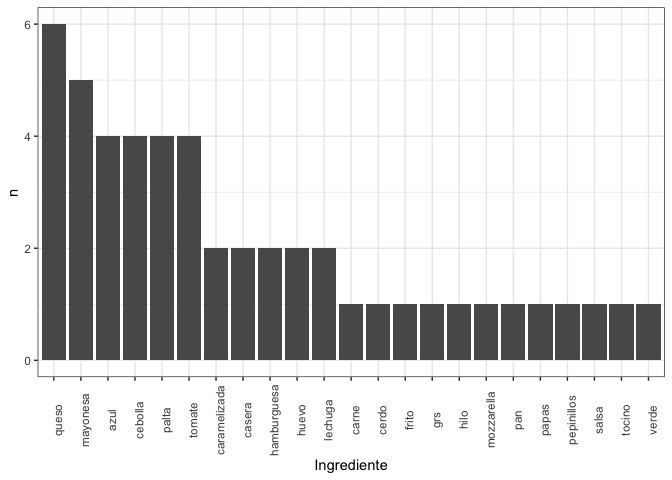<!-- -->

``` r
?mahalanobis
#DETECCIÓN DE OUTLIERS
# Obtenemos los datos de mahalnobis con una escala de [0,1]
sanguchez$mah = mahalanobis(cbind(Precio/max(Precio),nota/max(nota),cantidad_ingredientes/max(cantidad_ingredientes),suma1/max(suma1), suma2/max(suma2)) ,
                            colMeans(cbind(Precio/max(Precio),nota/max(nota),cantidad_ingredientes/max(cantidad_ingredientes),suma1/max(suma1), suma2/max(suma2))),
                            cov(cbind(cbind(Precio/max(Precio),nota/max(nota),cantidad_ingredientes/max(cantidad_ingredientes),suma1/max(suma1), suma2/max(suma2)))))


hist(sanguchez$mah)
```

<!-- -->

``` r
plot(Precio,sanguchez$mah)
```

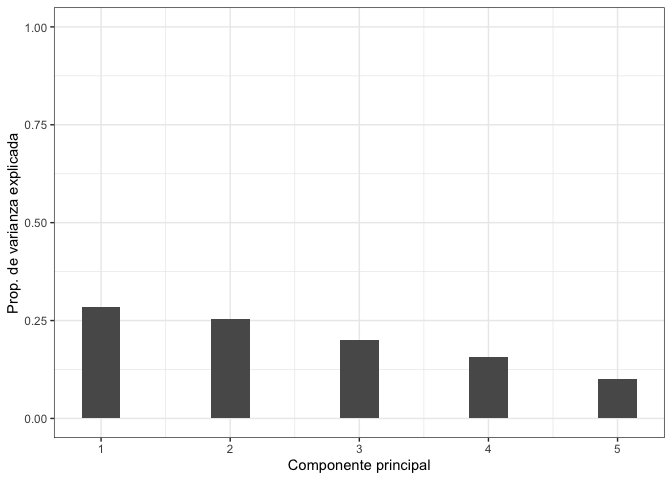<!-- -->

``` r
plot(nota,sanguchez$mah)
```

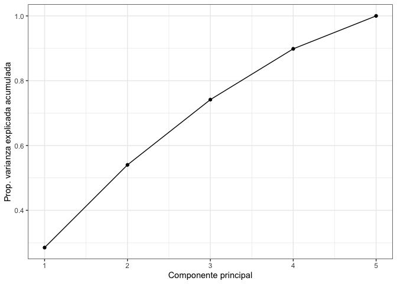<!-- -->

``` r
# Generar un vector boleano los dos valores más alejados segun la distancia Mahalanobis.
outlier2 <- rep(FALSE , nrow(cbind(Precio,nota)))
# Determinar el número de outlier que queremos encontrar.
num.outliers= 30
outlier2[sanguchez$mah[1:num.outliers]] <- TRUE
# Resaltar con un punto relleno los 2 valores outliers.
colorear.outlier <- outlier2 * 16
```

``` r
max(sanguchez$mah)
```

    ## [1] 25.35056

``` r
min(sanguchez$mah)
```

    ## [1] 0.5645465

``` r
plot(c(1:358),sanguchez$mah)
```

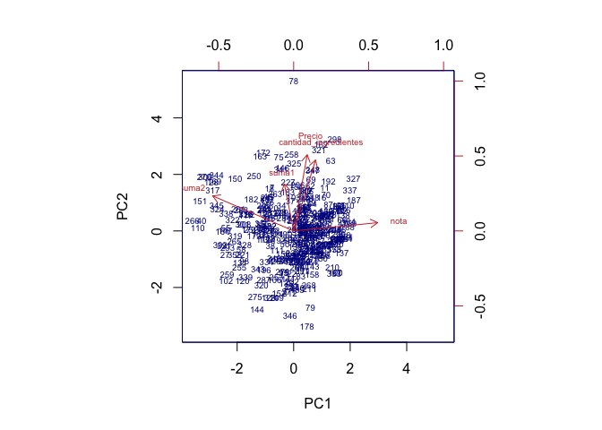<!-- -->

``` r
#Estandarizar, promedio, varianza, rotación
apply(X = DF[,c(4,6,11,12,13)], MARGIN = 2, FUN = mean)
```

    ##                Precio                  nota                 suma1 
    ##          6060.6145251             3.1536313             1.1005587 
    ##                 suma2 cantidad_ingredientes 
    ##             0.3324022             5.3603352

``` r
apply(X = DF[,c(4,6,11,12,13)], MARGIN = 2, FUN = var)
```

    ##                Precio                  nota                 suma1 
    ##          3.467804e+06          1.211625e+00          5.892994e-01 
    ##                 suma2 cantidad_ingredientes 
    ##          3.009640e-01          2.836181e+00

``` r
pca <- prcomp(DF[,c(4,6,11,12,13)], scale = TRUE)
names(pca)
```

    ## [1] "sdev"     "rotation" "center"   "scale"    "x"

``` r
pca$center
```

    ##                Precio                  nota                 suma1 
    ##          6060.6145251             3.1536313             1.1005587 
    ##                 suma2 cantidad_ingredientes 
    ##             0.3324022             5.3603352

``` r
pca$scale
```

    ##                Precio                  nota                 suma1 
    ##          1862.2039477             1.1007386             0.7676584 
    ##                 suma2 cantidad_ingredientes 
    ##             0.5486018             1.6840966

``` r
pca$rotation
```

    ##                               PC1        PC2         PC3         PC4
    ## Precio                 0.11286982 0.63579343 -0.20223635 -0.73586273
    ## nota                   0.70106624 0.06892841  0.26019116  0.11780555
    ## suma1                 -0.07802585 0.39340759  0.85619099  0.08185083
    ## suma2                 -0.67549827 0.29250183  0.03003164  0.16330640
    ## cantidad_ingredientes  0.18270353 0.59218979 -0.39678219  0.64129505
    ##                               PC5
    ## Precio                 0.02517172
    ## nota                   0.64975181
    ## suma1                 -0.31524572
    ## suma2                  0.65618129
    ## cantidad_ingredientes -0.21733665

``` r
head(pca$x)
```

    ##            PC1         PC2         PC3         PC4        PC5
    ## [1,] 0.2310138 -0.65550735  0.01060663  0.07279959 -0.4119725
    ## [2,] 0.3326610 -0.90847966 -1.06351109 -1.12194998  0.1519344
    ## [3,] 1.2041186 -0.04357482 -1.32983727 -0.36793200  0.4880368
    ## [4,] 1.0788449  0.59525394 -0.13094454 -1.19532232  0.2253543
    ## [5,] 0.8559759  0.16538652  1.16037425  0.78974105 -0.3655870
    ## [6,] 0.4176894  0.13656075 -0.36509343 -0.05615811 -0.5235878

``` r
dim(pca$x)
```

    ## [1] 358   5

``` r
#graficar
biplot(x = pca, scale = 0, cex = 0.6, col = c("blue4", "brown3"))
```

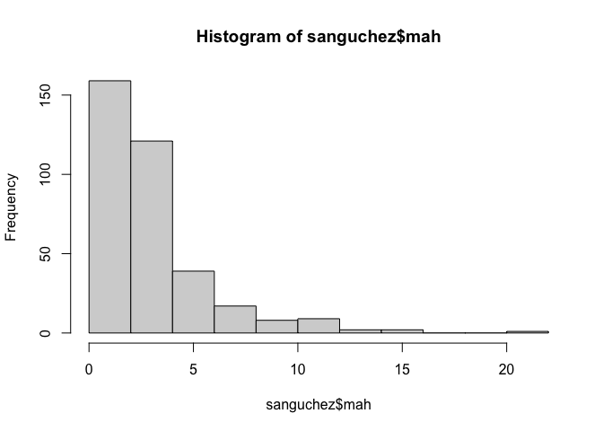<!-- -->

``` r
#varianza explicada
pca$sdev^2
```

    ## [1] 1.4249884 1.2760678 1.0068411 0.7839715 0.5081312

``` r
prop_varianza <- pca$sdev^2 / sum(pca$sdev^2)
prop_varianza
```

    ## [1] 0.2849977 0.2552136 0.2013682 0.1567943 0.1016262

``` r
#graficar
ggplot(data = data.frame(prop_varianza, pc = 1:5 ),
       aes(x = pc, y = prop_varianza)) +
  geom_col(width = 0.3) +
  scale_y_continuous(limits = c(0,1)) +
  theme_bw() +
  labs(x = "Componente principal",
       y = "Prop. de varianza explicada")
```

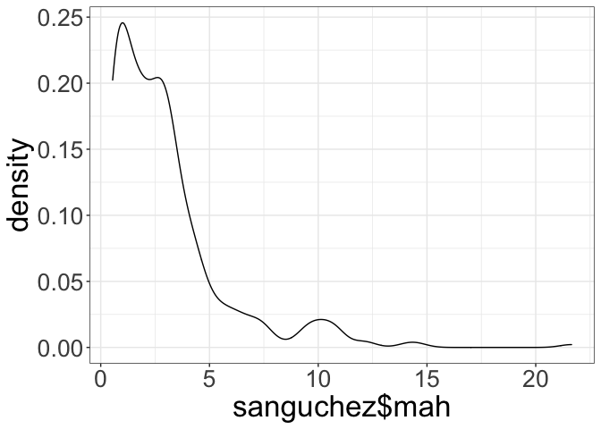<!-- -->

``` r
prop_varianza_acum <- cumsum(prop_varianza)
prop_varianza_acum
```

    ## [1] 0.2849977 0.5402113 0.7415795 0.8983738 1.0000000

``` r
ggplot(data = data.frame(prop_varianza_acum, pc = 1:5),
       aes(x = pc, y = prop_varianza_acum, group = 1)) +
  geom_point() +
  geom_line() +
  theme_bw() +
  labs(x = "Componente principal",
       y = "Prop. varianza explicada acumulada")
```

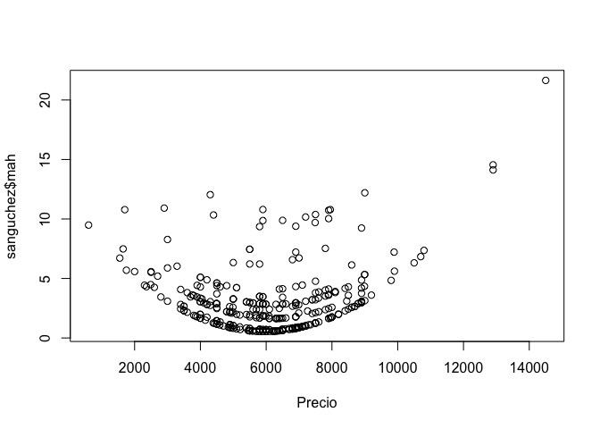<!-- -->

``` r
# entropia euclidiana
d = dist(x = cbind(Precio,nota), method = "euclidean")
class(d)
```

    ## [1] "dist"

``` r
# pearson
cor(x = cbind(Precio,nota,cantidad_ingredientes,suma1, suma2), method = "pearson")
```

    ##                           Precio        nota cantidad_ingredientes      suma1
    ## Precio                1.00000000  0.05605002            0.21789118 0.08103913
    ## nota                  0.05605002  1.00000000            0.11813673 0.08442988
    ## cantidad_ingredientes 0.21789118  0.11813673            1.00000000 0.01089397
    ## suma1                 0.08103913  0.08442988            0.01089397 1.00000000
    ## suma2                 0.03673252 -0.40950868            0.04281004 0.15320285
    ##                             suma2
    ## Precio                 0.03673252
    ## nota                  -0.40950868
    ## cantidad_ingredientes  0.04281004
    ## suma1                  0.15320285
    ## suma2                  1.00000000

``` r
cor.plot(cbind(Precio,nota,cantidad_ingredientes, suma1, suma2))
```

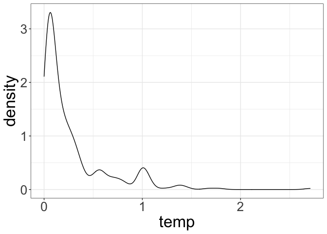<!-- -->

``` r
pairs(cbind(Precio,nota,cantidad_ingredientes, suma1, suma2))
```

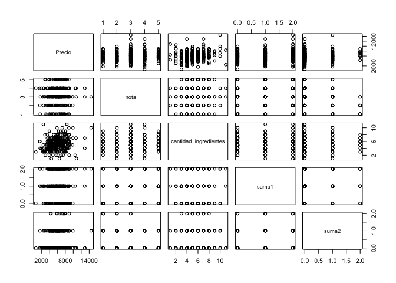<!-- -->

``` r
# similitud coseno:
# Coseno
coseno <- function(x, y){
  resultado <- x%*%y / (sqrt(x %*% x) * sqrt(y %*%y ))
  return(as.numeric(resultado))
}

coseno(Precio,nota)
```

    ## [1] 0.9081561

``` r
# Coseno tras centrar los vectores
a <- Precio - mean(Precio)
b <- nota - mean(nota)
coseno(a,b)
```

    ## [1] 0.05605002
